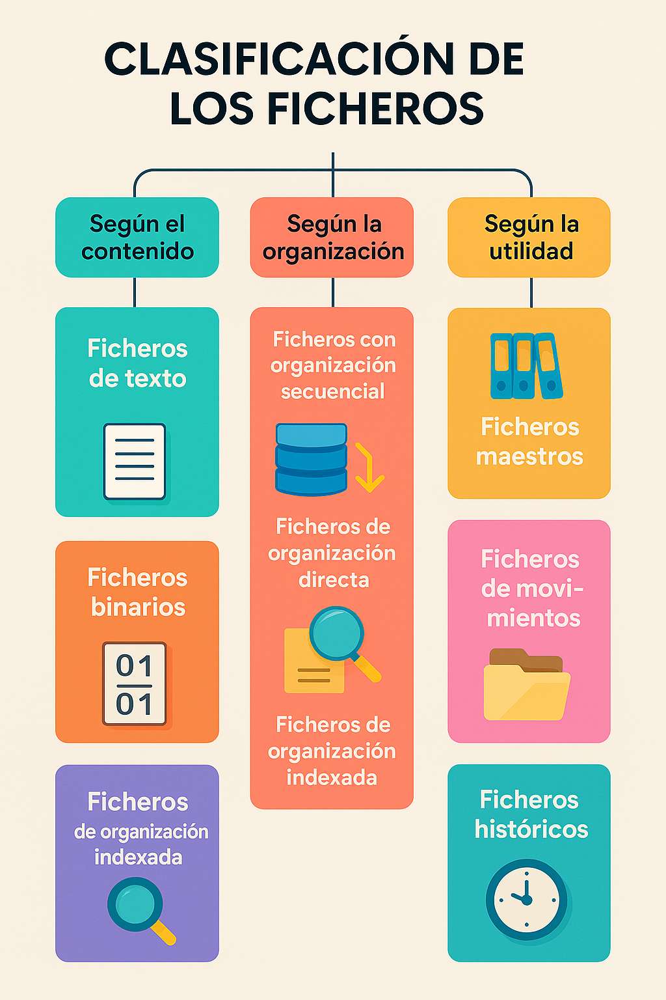
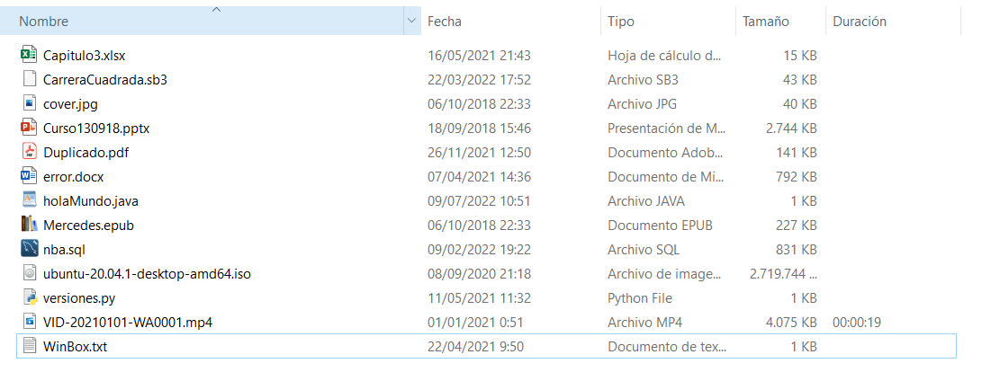
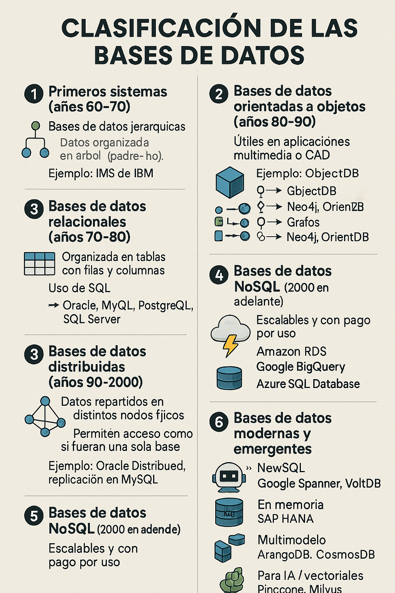
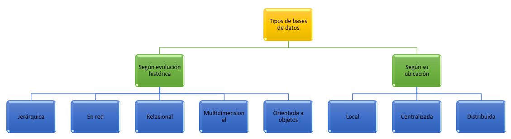
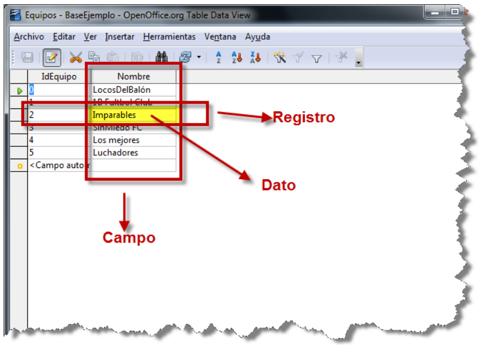

# UNIDAD 1. SISTEMAS DE INFORMACIÓN

- [UNIDAD 1. SISTEMAS DE INFORMACIÓN](#unidad-1-sistemas-de-información)
  - [1.- FICHEROS](#1--ficheros)
    - [1.1.- Tipos de ficheros y formatos](#11--tipos-de-ficheros-y-formatos)
  - [2.- BASES DE DATOS](#2--bases-de-datos)
    - [2.1.- Tipos de bases de datos](#21--tipos-de-bases-de-datos)
  - [3.- BASES DE DATOS RELACIONALES](#3--bases-de-datos-relacionales)
    - [3.1.- Conceptos](#31--conceptos)
    - [3.2.- Otros conceptos más específicos de las bases de datos](#32--otros-conceptos-más-específicos-de-las-bases-de-datos)
    - [3.3.- Sistemas Gestores de Bases de Datos](#33--sistemas-gestores-de-bases-de-datos)
    - [3.4.- Tipos de SGBD](#34--tipos-de-sgbd)
  - [HOJAS DE EJERCICIOS](#hojas-de-ejercicios)

## 📂 1.- FICHEROS

Un ordenador almacena muchos tipos de información. Toda esta información se guarda en los **dispositivos de almacenamiento** del ordenador. Para organizarla, se utilizan **ficheros** o **archivos**.  

Los ficheros son estructuras de información creadas por los sistemas operativos para almacenar datos. Cada fichero tiene un **nombre** y una **extensión**, que indica su **formato**.

---

### 📝 1.1.- Tipos de ficheros y formatos

El **formato** y **tipo de fichero** determinan cómo se interpreta la información que contiene. Un fichero es una **ristra de bits** (ceros y unos), por lo que es necesaria su interpretación para dar sentido a los datos.

#### 📄 1️⃣ Según el contenido
- **Ficheros de texto**: caracteres alfabéticos y números que entiende el ser humano.  
- **Ficheros binarios**: bits que almacenan sonido, vídeo, imágenes, etc. No se leen directamente como texto.

#### 🗂️ 2️⃣ Según la organización
Indica la forma de **acceso a los datos**:
- **Secuencial**: los datos están uno detrás de otro; para acceder a un dato concreto, se recorren los anteriores.  
- **Directa**: permite acceder directamente a un dato sin necesidad de leer los anteriores.  
- **Indexada**: acceso mediante un índice, facilitando la búsqueda rápida, como el índice de un libro.

> ⚠️ Existen variantes que combinan varias organizaciones para optimizar el acceso a los datos.

#### ⚙️ 3️⃣ Según la utilidad
Indica el **uso del fichero**:
- **Maestros**: contienen datos fundamentales para la organización. Ejemplo: datos de alumnos de un instituto.  
- **Movimientos**: almacenan cambios o actualizaciones de los ficheros maestros.  
- **Históricos**: guardan datos antiguos que ya no se usan en procesos diarios.

## 🏋️‍♂️ Ejercicios sobre ficheros

**Realiza los siguientes ejercicios:**

### 1️⃣ Abrir un fichero
- Busca en tu ordenador un fichero con extensión **`.docx`**.  
- Ábrelo con el **Bloc de notas**.  
- ❓ Pregunta: ¿Por qué no se ve bien el contenido del fichero?

---

### 2️⃣ Tabla de códigos ASCII
- Conéctate a **Internet** y busca una **tabla de códigos ASCII de 8 bits**.  
- Observa las siguientes características:  
  - Los **32 primeros caracteres** son **no imprimibles** y se utilizaban para el **control de transmisiones**.  
  - La **distancia entre mayúsculas y minúsculas** es exactamente de **32 caracteres**.

---

### 3️⃣ Identificación de ficheros
- Observa la siguiente **captura de una carpeta en Windows**.  
- ❓ Indica **el tipo de cada fichero** y **qué contiene**.

## 2.- BASES DE DATOS

Una **Base de datos**  es un conjunto de datos estructurados que pertenecen a un mismo contexto y, en cuanto a su función, se utiliza para administrar de forma electrónica grandes cantidades de información.

Anteriormente a las bases de datos, se utilizaban ficheros tradicionales, como los que hemos visto en el apartado anterior. Veamos según su definición cuales son sus diferencias.

- Los _ficheros tradicionales_ almacenan los datos en archivos individuales, exclusivos de cada aplicación en particular. Los datos de un fichero no están relacionados con datos de otros ficheros. Son unidades independientes. En este sistema, los datos pueden ser redundantes y la actualización de los datos es más lenta.
- Las _bases de datos_ tienen el almacenamiento de datos formalmente definido, controlado centralmente para intentar servir a múltiples y diferentes aplicaciones. La base de datos es una fuente de datos que son compartidos por numerosos usuarios para diversas aplicaciones.

Así, en un sistema de ficheros tradicional, la información está dispersa en varios ficheros de datos y existe un cierto número de programas que los recuperan y agrupan. Aunque los sistemas de ficheros o archivos supusieron un gran avance sobre los sistemas manuales, tienen inconvenientes bastante importantes que se solventaron, en gran medida, con la aparición de los sistemas de bases de datos.

### 2.1.- Tipos de bases de datos

Coincidiendo con la evolución histórica de las bases de datos éstas han utilizado distintos modelos:

---

# 📚 Evolución histórica de las bases de datos

### 1. 📂 **Primeros sistemas (años 60-70)**

* 🌳 **Bases de datos jerárquicas**

  * Datos organizados en árbol (padre-hijo).
  * Ejemplo: IMS de IBM.
* 🔗 **Bases de datos en red**

  * Nodos con múltiples relaciones.
  * Basadas en CODASYL.

---

### 2. 📊 **Bases de datos relacionales (años 70-80)**

* Organizadas en **tablas** con filas y columnas.
* Uso de **SQL**.
* Ejemplos: Oracle, MySQL, PostgreSQL, SQL Server.

---

### 3. 🧩 **Bases de datos orientadas a objetos (años 80-90)**

* Datos almacenados como **objetos** con atributos y métodos.
* Útiles en aplicaciones multimedia o CAD.
* Ejemplo: ObjectDB.

---

### 4. 🌐 **Bases de datos distribuidas (años 90-2000)**

* Datos repartidos en distintos nodos físicos.
* Permiten acceso como si fueran una sola base.
* Ejemplo: Oracle Distributed, replicación en MySQL.

---

### 5. ⚡ **Bases de datos NoSQL (2000 en adelante)**

* Diseñadas para **Big Data** y datos no estructurados.
* Principales tipos:

  * 🔑 Clave-valor → Redis, DynamoDB.
  * 📄 Documentales → MongoDB, CouchDB.
  * 📊 Columnas → Cassandra, HBase.
  * 🕸️ Grafos → Neo4j, OrientDB.

---

### 6. ☁️ **Bases de datos en la nube (2010 en adelante)**

* Escalables y con pago por uso.
* Ejemplos: Amazon RDS, Google BigQuery, Azure SQL Database.

---

### 7. 🤖 **Bases de datos modernas y emergentes**

* 🆕 **NewSQL** → Google Spanner, VoltDB.
* ⚡ **En memoria** → SAP HANA.
* 🔀 **Multimodelo** → ArangoDB, CosmosDB.
* 🧠 **Para IA / vectoriales** → Pinecone, Milvus.

---

## 🌍 Clasificación de las bases de datos según su ubicación

Otro modo de clasificar las bases de datos es **según dónde se encuentren ubicadas**. Veamos las más importantes:

---

### 💻 Bases de datos locales

En este caso, la **base de datos y el usuario están en el mismo ordenador**.

* Ejemplo: **Microsoft Access**, que resulta sencillo de manejar para usuarios poco expertos.
* Funciona bien en modo local siempre que no tenga que almacenar **grandes volúmenes de información**.
* Otros ejemplos: **SQLite** (muy usado en móviles y aplicaciones de escritorio), **dBase** (uno de los primeros sistemas personales).

---

### 🖥️ Bases de datos centralizadas

En los **sistemas centralizados**, toda la base de datos está en un **único servidor**, al que acceden todos los usuarios.

* Que esté en un mismo servidor no significa que esté en un solo archivo o en un único disco; puede estar repartida internamente.
* En el modelo **Cliente/Servidor**, la base de datos reside en el **servidor** y los usuarios acceden a ella **simultáneamente** desde sus ordenadores (clientes) a través de una red, ya sea local o Internet.
* 👉 Es el **sistema más utilizado en empresas actualmente**.
* Ejemplos comerciales: **Oracle Database**, **Microsoft SQL Server**, **IBM Db2**, **MySQL Enterprise**.

---

### 🌐 Bases de datos distribuidas

En este modelo, la información está **repartida en distintas localizaciones** que se encuentran conectadas mediante una **red** y gestionadas por un **sistema de bases de datos distribuidas**.

* Estas localizaciones suelen estar en **lugares geográficos distintos**.
* El sistema gestor se encarga de que los usuarios perciban los datos como si estuvieran en una única base.
* Ejemplos comerciales: **Google Spanner**, **Amazon Aurora**, **Microsoft Cosmos DB**, **CockroachDB**, **Cassandra (DataStax Enterprise)**.

---

**Realiza los siguientes ejercicios:**

1. Busca por Internet las ventajas y desventajas de utilizar un sistema de ficheros tradicional frente a un sistemas de bases de datos para almacenar información.
2. Busca por Internet un esquema o imagen que te ayude a identificar cada uno de los tipos de datos de las bases de datos que hemos visto.

## 3.- BASES DE DATOS RELACIONALES

Como ya hemos comentado, en este curso vamos a trabajar con las bases de datos relacionales. Veremos una serie de conceptos básicos sobre las bases de datos en general, y de las bases de datos relacionales en particular.

### 3.1.- Conceptos

**Datos:** son hechos conocidos que pueden registrarse y que tienen un significado implícito. Pueden constituir datos los nombres, números telefónicos y direcciones de personas que conocemos.

**Tipo de Dato:** El tipo de dato indica la naturaleza del campo. Así, se puede tener datos numéricos, que son aquellos con los que se pueden realizar cálculos aritméticos (sumas, restas, multiplicaciones…), los datos alfanuméricos, que son los que contienen caracteres alfabéticos y números…

**Tabla:** Es un conjunto de filas y columnas bajo un mismo nombre que representa el conjunto de valores almacenados para una serie de datos. Por ejemplo,la información de todos los clientes de una BD se almacenarán en una tabla llamada CLIENTES.

**Campo:** Cada una de las columnas de una tabla. Identifica una familia de datos. Por ejemplo, el campo fechaNacimiento representa las fechas de nacimiento de todos los clientes que contiene una tabla CLIENTES.

**Campo clave:** Es un campo especial que identifica de forma única a cada registro. Por ejemplo, el NIF es único para cada persona, por tanto puede ser su campo clave. Existen distivos tipos de campos clave que veremos más adelante.

**Registro:** Corresponde a cada una de las filas de la tabla. También se llaman tuplas. Por ejemplo en la siguiente tabla CLIENTES, observamos dos registros, que corresponden a la información sobre los clientes Juan García y Fernándo Martínez.

### 3.2.- Otros conceptos más específicos de las bases de datos

**Entidades:** Una entidad es todo aquello de lo cual interesa guardar datos, por ejemplo:
- Guardar datos de una persona, de un producto, de un animal...
- Imaginad que queremos almacenar datos de la entidad Persona, cuyos atributos pueden ser: DNI, nombre, apellidos, dirección, teléfono...

**Claves primarias y claves foráneas o ajenas. Relaciones:** Cada entidad tiene una clave primaria o campo clave o llave que identifica unívocamente al conjunto de datos. Cuando en una entidad figura la clave primaria de otra entidad, ésta se denomina clave foránea o clave ajena. Las entidades se relacionan entre sí a través de las claves foráneas.

- En este gráfico tenemos dos entidades: Clientes y Vehículos. 
- La clave primaria de Clientes es: CodCliente
- La clave primaria de Vehículos es: Matricula
- La clave foránea de Vehículos es CodCliente. Los Clientes se relacionan con Vehículos a través del CodCliente que figura en ambas tablas.

**Restricción de integridad referencial:** Esta restricción significa que el valor de un campo que es clave ajena siempre deben estar relacionadas con un valor correcto de la clave primaria en la tabla principal. La integridad referencial garantiza que la relación entre dos tablas permanezca sincronizada durante las operaciones de actualización y eliminación. 

- En el ejemplo anterior, no podemos tener un Vehículo cuyo codigo de cliente no exista previamente en la tabla de Clientes.

**Metadatos:** Metadatos son datos acerca de los datos presentes en la base de datos. Por ejemplo:

- qué tipo de datos se van a almacenar (si son texto o números o fechas …)
- qué nombre se le da a cada dato (nombre, apellidos, fecha, precio, edad,…)
- cómo están agrupados los datos
- cómo se relacionan,….

### 3.3.- Sistemas Gestores de Bases de Datos

Un sistema gestor de bases de datos (SGBD) es una aplicación que permite a los usuarios definir, crear y mantener una base de datos, y proporciona acceso controlado a la misma.

En general, un SGBD proporciona los siguientes servicios:

- **(DDL – Data Description Language)**: Permite la definición de la base de datos mediante el lenguaje de definición de datos. Este lenguaje permite especificar la estructura y el tipo de los datos, así como las restricciones sobre los datos. Todo esto se almacenará en la base de datos.
- **(DML - Data Manipulation Language)**: Permite la inserción, actualización, eliminación y consulta de datos mediante el lenguaje de manejo o manipulación de datos.
- **(DCL - Data Control Language)**: Proporciona un acceso controlado a la base de datos mediante:
    - Un sistema de seguridad, de modo que los usuarios no autorizados no puedan acceder a la base de datos, mediante el lenguaje de control de datos.
    - Un sistema de integridad que mantiene la integridad y la consistencia de los datos;
    - Un sistema de control de concurrencia que permite el acceso compartido a la base de datos;
    - Un sistema de control de recuperación que restablece la base de datos después de que se produzca un fallo del hardware o del software;
    - Un diccionario de datos o catálogo accesible por el usuario que contiene la descripción de los datos de la base de datos.

La principal herramienta de un SGBD es la interfaz de programación con el usuario. Esta interfaz consiste en un lenguaje muy sencillo mediante el cual el usuario interactua con el servidor. Este lenguaje comúnmente se denomina SQL, Structure Query Language, está estandarizado, es decir, todas las BD que soporten SQL deben tener la misma sintaxis a la hora de aplicar el lenguaje.

### 3.4.- Tipos de SGBD

Los SGBD se pueden clasificar según las BD que gestionan (jerárquicas, relacionales, orientadas a objetos,…), pero como actualmente la mayoría de los SGBD integran múltiples filosofías, los clasificaremos según su capacidad y potencia del propio gestor, resultado los siguientes SGBD:

- _SGBD ofimáticos_: manipulas BD pequeñas orientadas a almacenar datos domésticos o de pequeñas empresas. Ejemplos típicos son Microsoft ACCESS y LibreOffice Base.
- _SGBD corporativos_: tienen la capacidad de gestionar BD enormes, de medianas o grandes empresas con una carga de datos y transacciones que requieren de un servidor de gran capacidad. Un ejemplo típico de BD corporativas es ORACLE, actualmente junto de DB2 el servidor de BD más potente del mercado (también el más caro). Nosotros para nuestro aprendizaje utilizamos una versión gratuita con fines educativos, que aunque bastante limitada, nos sirve para introducirnos en la filosofía de ORACLE.

## HOJAS DE EJERCICIOS

💻 Hoja de ejercicios 1.

💻 Hoja de ejercicios 2.

💻 Hoja de ejercicios 3.

💻 Hoja de ejercicios 4.

💻 Hoja de ejercicios 5.

