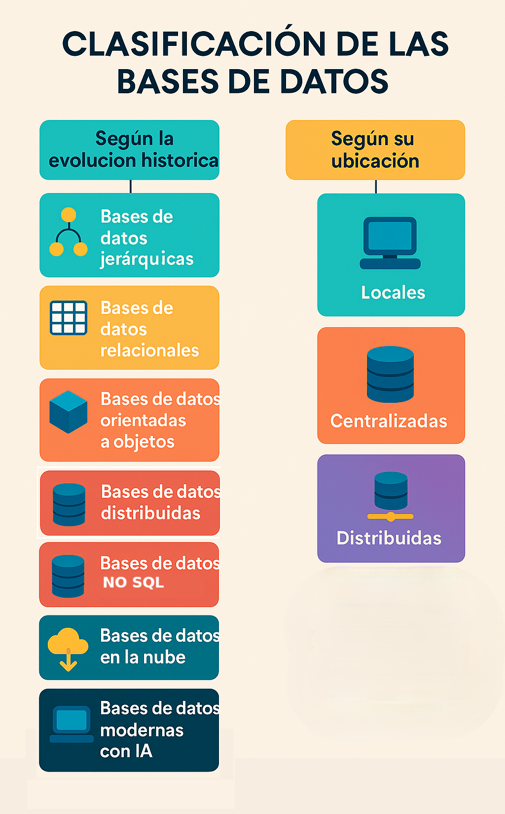
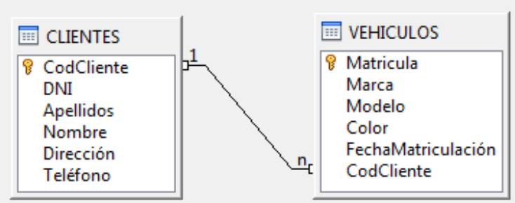

# UNIDAD 1. SISTEMAS DE INFORMACIÓN
1. [UNIDAD 1. SISTEMAS DE INFORMACIÓN](#unidad-1-sistemas-de-información)
   1. [📂 1.- FICHEROS](#-1--ficheros)
      1. [📝 1.1.- Tipos de ficheros y formatos](#-11--tipos-de-ficheros-y-formatos)
   2. [🗄️ 2.- BASES DE DATOS](#️-2--bases-de-datos)
      1. [🏷️ 2.1.- Tipos de bases de datos](#️-21--tipos-de-bases-de-datos)
   3. [🗄️ 3.- BASES DE DATOS RELACIONALES](#️-3--bases-de-datos-relacionales)
      1. [📝 3.1.- Conceptos](#-31--conceptos)
      2. [📌 3.2.- Otros conceptos más específicos de las bases de datos](#-32--otros-conceptos-más-específicos-de-las-bases-de-datos)
      3. [🖥️ 3.3.- Sistemas Gestores de Bases de Datos (SGBD)](#️-33--sistemas-gestores-de-bases-de-datos-sgbd)
      4. [🏷️ 3.4.- Tipos de SGBD](#️-34--tipos-de-sgbd)

## 📂 1.- FICHEROS

Un ordenador almacena muchos tipos de información. Toda esta información se guarda en los **dispositivos de almacenamiento** del ordenador. Para organizarla, se utilizan **ficheros** o **archivos**.  

Los ficheros son estructuras de información creadas por los sistemas operativos para almacenar datos. Cada fichero tiene un **nombre** y una **extensión**, que indica su **formato**.

### 📝 1.1.- Tipos de ficheros y formatos

El **formato** y **tipo de fichero** determinan cómo se interpreta la información que contiene. Un fichero es una **ristra de bits** (ceros y unos), por lo que es necesaria su interpretación para dar sentido a los datos.

#### 📄 1️⃣ Según el contenido
- **Ficheros de texto**: caracteres alfabéticos y números que entiende el ser humano.  
- **Ficheros binarios**: bits que almacenan sonido, vídeo, imágenes, etc. No se leen directamente como texto.

#### 🗂️ 2️⃣ Según la organización
Indica la forma de **acceso a los datos**:
- **Secuencial**: los datos están uno detrás de otro; para acceder a un dato concreto, se recorren los anteriores.  
- **Directa**: permite acceder directamente a un dato sin necesidad de leer los anteriores.  
- **Indexada**: acceso mediante un índice, facilitando la búsqueda rápida, como el índice de un libro.

> ⚠️ Existen variantes que combinan varias organizaciones para optimizar el acceso a los datos.

#### ⚙️ 3️⃣ Según la utilidad
Indica el **uso del fichero**:
- **Maestros**: contienen datos fundamentales para la organización. Ejemplo: datos de alumnos de un instituto.  
- **Movimientos**: almacenan cambios o actualizaciones de los ficheros maestros.  
- **Históricos**: guardan datos antiguos que ya no se usan en procesos diarios.

#### 🏋️‍♂️ Ejercicios sobre ficheros

**Realiza los siguientes ejercicios:**

#### 1️⃣ Abrir un fichero
- Busca en tu ordenador un fichero con extensión **`.docx`**.  
- Ábrelo con el **Bloc de notas**.  
- ❓ Pregunta: ¿Por qué no se ve bien el contenido del fichero?

#### 2️⃣ Tabla de códigos ASCII
- 📝 **Tabla ASCII**: Es un conjunto estandarizado de códigos numéricos que representan caracteres que una computadora puede entender.

📦 Contenido de la tabla ASCII:

- Caracteres de control (0–31 y 127): No se imprimen; se usaban para controlar dispositivos, como el retorno de carro CR o salto de línea LF.

- Símbolos y signos de puntuación: Por ejemplo !, @, #, $, %.

- Números (48–57): Los dígitos del 0 al 9.

- Letras mayúsculas (65–90): A a Z.

- Letras minúsculas (97–122): a a z.
  
- Caracteres extendidos (128–255, en ASCII extendido): Permiten letras acentuadas, símbolos gráficos y otros caracteres especiales.

💻 Uso en informática: Permite almacenar, interpretar y transmitir texto de manera uniforme entre sistemas y dispositivos, garantizando que todos comprendan los mismos caracteres.

- Conéctate a **Internet** y busca una **tabla de códigos ASCII de 8 bits**.  

#### 3️⃣ Identificación de ficheros
- Observa la siguiente **captura de una carpeta en Windows**.  
- ❓ Indica **el tipo de cada fichero** y **qué contiene**.

## 🗄️ 2.- BASES DE DATOS

Una **Base de datos (BD)** es un conjunto de **datos estructurados** que pertenecen a un mismo contexto.  
💻 **Función:** administrar de forma electrónica grandes cantidades de información.

Anteriormente, se utilizaban **ficheros tradicionales** (como los vistos en el apartado anterior). Veamos las diferencias según su definición:

- 📝 **Ficheros tradicionales:**  
  - Almacenan los datos en archivos individuales, exclusivos de cada aplicación.  
  - Los datos de un fichero no están relacionados con otros ficheros; son **unidades independientes**.  
  - Pueden existir **datos redundantes** y la actualización es más lenta.

- 🗄️ **Bases de datos:**  
  - El almacenamiento de datos está **formalmente definido** y controlado **centralmente**.  
  - Permite **servir a múltiples aplicaciones**.  
  - Los datos son **compartidos** por varios usuarios para diversas aplicaciones.

> ⚠️ En un sistema de ficheros tradicional, la información está dispersa en varios archivos y requiere programas adicionales para recuperarla y agruparla.  
> ✅ Las bases de datos solucionan gran parte de estos inconvenientes.

### 🏷️ 2.1.- Tipos de bases de datos

A lo largo de la historia, las bases de datos han utilizado distintos **modelos** según su evolución tecnológica:

#### 📚 Evolución histórica de las bases de datos

##### 1. 📂 **Primeros sistemas (años 60-70)**

* 🌳 **Bases de datos jerárquicas**

  * Datos organizados en árbol (padre-hijo).
  * Ejemplo: IMS de IBM.
* 🔗 **Bases de datos en red**

  * Nodos con múltiples relaciones.
  * Basadas en CODASYL.

##### 2. 📊 **Bases de datos relacionales (años 70-80)**

* Organizadas en **tablas** con filas y columnas.
* Uso de **SQL**.
* Ejemplos: Oracle, MySQL, PostgreSQL, SQL Server.

##### 3. 🧩 **Bases de datos orientadas a objetos (años 80-90)**

* Datos almacenados como **objetos** con atributos y métodos.
* Útiles en aplicaciones multimedia o CAD.
* Ejemplo: ObjectDB.

##### 4. 🌐 **Bases de datos distribuidas (años 90-2000)**

* Datos repartidos en distintos nodos físicos.
* Permiten acceso como si fueran una sola base.
* Ejemplo: Oracle Distributed, replicación en MySQL.

##### 5. ⚡ **Bases de datos NoSQL (2000 en adelante)**

* Diseñadas para **Big Data** y datos no estructurados.
* Principales tipos:

  * 🔑 Clave-valor → Redis, DynamoDB.
  * 📄 Documentales → MongoDB, CouchDB.
  * 📊 Columnas → Cassandra, HBase.
  * 🕸️ Grafos → Neo4j, OrientDB.

##### 6. ☁️ **Bases de datos en la nube (2010 en adelante)**

* Escalables y con pago por uso.
* Ejemplos: Amazon RDS, Google BigQuery, Azure SQL Database.

##### 7. 🤖 **Bases de datos modernas y emergentes**

* 🆕 **NewSQL** → Google Spanner, VoltDB.
* ⚡ **En memoria** → SAP HANA.
* 🔀 **Multimodelo** → ArangoDB, CosmosDB.
* 🧠 **Para IA / vectoriales** → Pinecone, Milvus.

#### 🌍 Clasificación de las bases de datos según su ubicación

Otro modo de clasificar las bases de datos es **según dónde se encuentren ubicadas**. Veamos las más importantes:

##### 1. 💻 Bases de datos locales

En este caso, la **base de datos y el usuario están en el mismo ordenador**.

* Ejemplo: **Microsoft Access**, que resulta sencillo de manejar para usuarios poco expertos.
* Funciona bien en modo local siempre que no tenga que almacenar **grandes volúmenes de información**.
* Otros ejemplos: **SQLite** (muy usado en móviles y aplicaciones de escritorio), **dBase** (uno de los primeros sistemas personales).

##### 2. 🖥️ Bases de datos centralizadas

En los **sistemas centralizados**, toda la base de datos está en un **único servidor**, al que acceden todos los usuarios.

* Que esté en un mismo servidor no significa que esté en un solo archivo o en un único disco; puede estar repartida internamente.
* En el modelo **Cliente/Servidor**, la base de datos reside en el **servidor** y los usuarios acceden a ella **simultáneamente** desde sus ordenadores (clientes) a través de una red, ya sea local o Internet.
* 👉 Es el **sistema más utilizado en empresas actualmente**.
* Ejemplos comerciales: **Oracle Database**, **Microsoft SQL Server**, **IBM Db2**, **MySQL Enterprise**.

##### 3. 🌐 Bases de datos distribuidas

En este modelo, la información está **repartida en distintas localizaciones** que se encuentran conectadas mediante una **red** y gestionadas por un **sistema de bases de datos distribuidas**.

* Estas localizaciones suelen estar en **lugares geográficos distintos**.
* El sistema gestor se encarga de que los usuarios perciban los datos como si estuvieran en una única base.
* Ejemplos comerciales: **Google Spanner**, **Amazon Aurora**, **Microsoft Cosmos DB**, **CockroachDB**, **Cassandra (DataStax Enterprise)**.

#### 🏋️‍♂️ Ejercicios sobre bases de datos

**Realiza los siguientes ejercicios:**

#### 1️⃣ Comparativa de sistemas
- 🌐 Busca en **Internet** las **ventajas y desventajas** de:  
  - **Sistema de ficheros tradicional**  
  - **Sistema de bases de datos**  
- ❓ Reflexiona sobre **cuándo es mejor usar uno u otro**.

#### 2️⃣ Tipos de datos en bases de datos
- Busca en **Internet** un **esquema o imagen** que te ayude a **identificar cada tipo de dato** de las bases de datos que hemos visto.  
- Puedes guardar la imagen para usarla como **apunte visual**.

## 🗄️ 3.- BASES DE DATOS RELACIONALES

En este curso trabajaremos con **bases de datos relacionales**.  
Veremos conceptos básicos sobre **bases de datos en general** y **bases de datos relacionales** en particular.

### 📝 3.1.- Conceptos

- **📊 Datos:** hechos conocidos que pueden registrarse y tienen un **significado**.  
  Ejemplo: nombres, números de teléfono y direcciones de personas.

- **🔢 Tipo de dato:** indica la **naturaleza del campo**.  
  - Datos **numéricos**: se pueden usar para cálculos aritméticos (sumas, restas…).  
  - Datos **alfanuméricos**: contienen caracteres alfabéticos y números.

- **📋 Tabla:** conjunto de **filas y columnas** bajo un mismo nombre, que almacena valores para una serie de datos.  
  Ejemplo: la información de todos los clientes de una BD se guarda en la tabla `CLIENTES`.

- **🏷️ Campo:** cada una de las **columnas** de una tabla. Identifica una **familia de datos**.  
  Ejemplo: `fechaNacimiento` representa las fechas de nacimiento de todos los clientes.

- **🔑 Campo clave:** campo especial que **identifica de forma única** cada registro.  
  Ejemplo: el `NIF` es único para cada persona, por lo que puede ser su campo clave.  
  > ⚠️ Existen distintos tipos de campos clave que se verán más adelante.

- **📌 Registro (o tupla):** cada **fila** de la tabla. Contiene todos los valores de un conjunto de campos para un elemento.  
  Ejemplo: en la tabla `CLIENTES`, un registro puede contener la información de Juan García o Fernando Martínez.

### 📌 3.2.- Otros conceptos más específicos de las bases de datos

- **🏛️ Entidades:** Todo aquello de lo cual interesa **guardar datos**.  
  Ejemplos:  
  - Persona  
  - Producto  
  - Animal  

  > Ejemplo práctico:  
  > Si queremos almacenar datos de la entidad **Persona**, sus atributos pueden ser:  
  > - DNI  
  > - Nombre  
  > - Apellidos  
  > - Dirección  
  > - Teléfono

- **🔑 Claves primarias y foráneas (ajenas). Relaciones:**  
  - Cada entidad tiene una **clave primaria** (campo clave o llave) que **identifica unívocamente** cada registro.  
  - Cuando una entidad incluye la **clave primaria de otra entidad**, se denomina **clave foránea** o **clave ajena**.  
  - Las entidades se **relacionan** entre sí a través de estas **claves foráneas**, creando vínculos entre los datos.

- **📊 Ejemplo de entidades y claves:**  
  - En este gráfico tenemos dos entidades: **Clientes** y **Vehículos**.  
  - La **clave primaria** de Clientes es: `CodCliente`  
  - La **clave primaria** de Vehículos es: `Matricula`  
  - La **clave foránea** de Vehículos es: `CodCliente`.  
    - Los Clientes se relacionan con Vehículos a través del `CodCliente` que figura en ambas tablas.

- **🔗 Restricción de integridad referencial:**  
  - Esta restricción garantiza que un **campo clave ajena** siempre esté relacionado con un valor válido de la **clave primaria** de la tabla principal.  
  - Mantiene la relación entre dos tablas **sincronizada** durante operaciones de actualización y eliminación.  
  - Ejemplo: no podemos tener un Vehículo cuyo código de cliente **no exista** previamente en la tabla de Clientes.

- **🗂️ Metadatos:**  
  - Son **datos sobre los datos** presentes en la base de datos.  
  - Ejemplos:  
    - Qué tipo de datos se van a almacenar (texto, números, fechas…)  
    - Qué nombre se le da a cada dato (nombre, apellidos, fecha, precio, edad…)  
    - Cómo están agrupados los datos  
    - Cómo se relacionan entre sí

### 🖥️ 3.3.- Sistemas Gestores de Bases de Datos (SGBD)

Un **Sistema Gestor de Bases de Datos (SGBD)** es una aplicación que permite a los usuarios **definir, crear y mantener una base de datos**, proporcionando **acceso controlado** a la misma.

#### ⚙️ Servicios que proporciona un SGBD

- **📐 DDL – Data Description Language:**  
  - Permite la **definición de la base de datos** mediante el lenguaje de definición de datos.  
  - Especifica la **estructura**, el **tipo de datos** y las **restricciones** que se almacenan en la BD.

- **📝 DML – Data Manipulation Language:**  
  - Permite **insertar, actualizar, eliminar y consultar** datos mediante el lenguaje de manipulación de datos.

- **🔒 DCL – Data Control Language:**  
  Proporciona **acceso controlado** mediante:  
  - Sistema de **seguridad**, evitando que usuarios no autorizados accedan a la BD.  
  - Sistema de **integridad**, manteniendo la consistencia de los datos.  
  - Sistema de **control de concurrencia**, permitiendo el acceso compartido.  
  - Sistema de **recuperación**, restableciendo la BD tras fallos de hardware o software.  
  - **Diccionario de datos** o catálogo accesible al usuario que describe los datos de la BD.

> 💡 La principal herramienta de un SGBD es la **interfaz de usuario**, normalmente mediante **SQL (Structure Query Language)**, un lenguaje estandarizado que permite interactuar con el servidor de manera uniforme.

### 🏷️ 3.4.- Tipos de SGBD

Los SGBD se pueden clasificar según el tipo de BD que gestionan (jerárquicas, relacionales, orientadas a objetos…), pero actualmente se suele clasificar según **capacidad y potencia**:

- **🖇️ SGBD ofimáticos:**  
  - Manejan **BD pequeñas**, para datos domésticos o de pequeñas empresas.  
  - Ejemplos: Microsoft **ACCESS**, LibreOffice **Base**.

- **🏢 SGBD corporativos:**  
  - Gestionan **BD grandes**, para medianas o grandes empresas con alto volumen de datos y transacciones.  
  - Ejemplos: **ORACLE**, **DB2**.  
  - Para aprendizaje se pueden usar versiones **gratuitas educativas**, limitadas pero útiles para entender la filosofía de ORACLE.

#### 📝 HOJAS DE EJERCICIOS

- 💻 **Hoja de ejercicios 1**  
- 💻 **Hoja de ejercicios 2**  
- 💻 **Hoja de ejercicios 3**  
- 💻 **Hoja de ejercicios 4**  
- 💻 **Hoja de ejercicios 5**

