# UNIDAD 2. DISEÑO LÓGICO DE LA BASE DE DATOS.

- [UNIDAD 2. DISEÑO LÓGICO DE LA BASE DE DATOS.](#unidad-2-diseño-lógico-de-la-base-de-datos)
  - [1.- 📊 MODELO DE DATOS](#1---modelo-de-datos)
    - [📌 Modelos de datos más utilizados](#-modelos-de-datos-más-utilizados)
    - [1.1.- 🔎 Clasificación de los modelos de datos](#11---clasificación-de-los-modelos-de-datos)
  - [2.- 🗂️ LOS DIAGRAMAS E/R](#2--️-los-diagramas-er)
    - [2.1.- 🟦 Entidades](#21---entidades)
    - [2.2.- 📝 Atributos y tipos](#22---atributos-y-tipos)
    - [2.3.- 🔗 Relaciones](#23---relaciones)
    - [2.4.- 🔢 Cardinalidad](#24---cardinalidad)
    - [2.5.- 🔄 Tipo de Correspondencia](#25---tipo-de-correspondencia)
    - [2.6.- 🏛️ Debilidad](#26--️-debilidad)
  - [3.- 🏗️ EL MODELO E/R AMPLIADO](#3--️-el-modelo-er-ampliado)
  - [4.- 🛠️ CONSTRUCCIÓN DE UN DIAGRAMA E/R](#4--️-construcción-de-un-diagrama-er)
  - [5.- 🗄️ MODELO RELACIONAL](#5--️-modelo-relacional)
    - [5.1.- 📋 Elementos de una relación](#51---elementos-de-una-relación)
    - [5.2.- ⚖️ Restricciones del modelo relacional](#52--️-restricciones-del-modelo-relacional)
    - [5.3.- 🔑 Claves primarias y claves ajenas](#53---claves-primarias-y-claves-ajenas)
    - [5.4.- 🛡️ Integridad referencial](#54--️-integridad-referencial)
    - [5.5.- 🖼️ Representación del modelo Relacional](#55--️-representación-del-modelo-relacional)
    - [5.6.- 🔄 Paso del modelo E/R al modelo Relacional](#56---paso-del-modelo-er-al-modelo-relacional)
  - [6.- 🧩 NORMALIZACIÓN](#6---normalización)
    - [6.1.- 1FN (Primera forma normal)](#61--1fn-primera-forma-normal)
    - [6.2.- 2FN (Segunda forma normal)](#62--2fn-segunda-forma-normal)
    - [6.3.- 3FN (Tercera forma normal)](#63--3fn-tercera-forma-normal)

## 1.- 📊 MODELO DE DATOS

Un modelo pretende crear una simplificación de la realidad para poder comprenderla mejor.  
Para realizar un modelo se realiza una **abstracción más simple** de la realidad.  

Se usan modelos en diferentes áreas de la informática, como por ejemplo:  
- UML en Ingeniería del Software  
- Modelo Entidad/Relación para BD  

Un **modelo de datos** es un conjunto de herramientas y reglas para representar:  
- Datos  
- Relaciones entre éstos  
- Restricciones de una base de datos  

### 📌 Modelos de datos más utilizados
- Relacional  
- Jerárquico  
- En red  
- Orientado a Objetos  
- Relacional orientado a objetos  

---

### 1.1.- 🔎 Clasificación de los modelos de datos

Una opción bastante usada a la hora de clasificar los modelos de datos es hacerlo de acuerdo al **nivel de abstracción** que presentan:

- 🧠 **Modelos de Datos Conceptuales**  
  Se usan en la fase de *Análisis*. Representan datos y relaciones.  
  Ejemplo: *Modelo Entidad-Relación*  

- ⚙️ **Modelos de Datos Lógicos**  
  Describen la estructura de la base de datos según el SGBD.  
  Ejemplo: *Modelo Relacional*  

- 💾 **Modelos de Datos Físicos**  
  Indican cómo se implementan los datos en el SGBD.  
  Ejemplos: Access, MySQL, PostgreSQL, Oracle...  

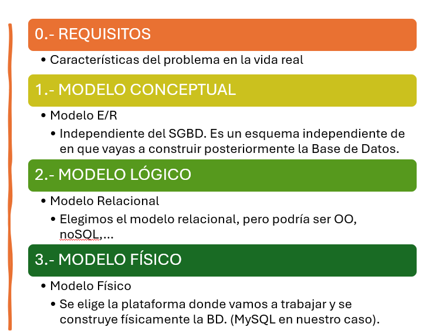

En este tema vamos a trabajar el modelo conceptual, más concretamente el modelo Entidad-Relación, o modelo E-R.

## 2.- 🗂️ LOS DIAGRAMAS E/R

El modelo Entidad-Relación es un modelo **puramente conceptual**. Representa el funcionamiento de un sistema de información mediante un diagrama Entidad-Relación (E/R). Facilita enormemente el diseño de una base de datos. Es muy representativo del funcionamiento del sistema de información y es **independiente del SGBD**. Toma como referencia la percepción que tenemos del funcionamiento del mundo real.

En un **esquema Entidad–Relación** representamos de manera gráfica cómo se organiza la información en una base de datos. Consta solo de tres elementos:

- **Entidades**: son los objetos principales sobre los que queremos almacenar información (por ejemplo, un *Cliente*, un *Coche*, un *Empleado*…). Cada entidad se representa con un **rectángulo**.  
- **Atributos**: son las propiedades o características de las entidades. Por ejemplo, un *Cliente* puede tener como atributos *nombre*, *teléfono* o *dirección*, y un *Coche* puede tener *matrícula* o *marca*. Los atributos se representan con **círculos**, unidos a la entidad a la que pertenecen.  
- **Relaciones**: muestran cómo se conectan las entidades entre sí. Por ejemplo, un *Cliente* puede **alquilar** un *Coche*. Las relaciones se representan con un **rombo**, que se une mediante **líneas** a las entidades que relaciona.

De esta forma, el diagrama nos permite ver de un vistazo qué entidades forman parte del sistema, qué características tiene cada una y cómo se relacionan entre ellas.

Se han desarrollado varios modelos E/R y diagramas de representación para el modelo. En este curso vamos a usar el **modelo de Chen**.  
Vemos en la siguiente imagen un ejemplo de Diagrama E-R siguiendo este modelo:  

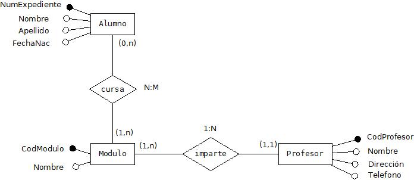

En los siguientes apartados vamos a ir desgranando los elementos que componen un diagrama E-R y cómo se construye.  

---

### 2.1.- 🟦 Entidades

Las **entidades** son uno de los elementos usados en los diagramas E/R. Una entidad es un objeto, sujeto o concepto sobre el que se recoge información básica en el sistema para poder realizar los procesos que se requieran.  

En el esquema anterior, serían entidades:  
- ALUMNO  
- MODULO  
- PROFESOR  

Una entidad se representa en un diagrama E/R mediante un **rectángulo**.  

---

### 2.2.- 📝 Atributos y tipos

Un **atributo** es una propiedad o característica de una entidad. Como veremos más adelante, las **relaciones también pueden tener atributos**.  

Por ejemplo, la entidad ALUMNO puede tener los atributos:  
- Numero  
- Nombre  
- Apellidos  
- Fecha Nacimiento  
- Población  

Los atributos de una entidad se representan mediante **pequeños círculos unidos a la entidad por una línea**.  Al lado de cada círculo se escribe el nombre del atributo.  

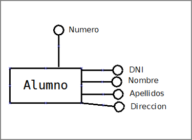

El **dominio de un atributo** es todo el conjunto de valores que se pueden asignar a ese atributo.  

Ejemplos de atributos y dominios de la entidad EMPLEADO:  

| Atributo        | Dominio                                      |
|-----------------|----------------------------------------------|
| DNI             | Cadena de caracteres de longitud 9           |
| Nombre          | Cadena de caracteres de longitud 20          |
| Apellidos       | Cadena de caracteres de longitud 30          |
| Antigüedad      | Fecha                                        |
| Salario         | Número real con dos decimales                |
| Categoría       | Enumerado de categorías                      |
| JornadaCompleta | Verdadero o Falso                            |

#### ✍️ Ejercicio

**Realiza el siguiente ejercicio:**

1️⃣ Indica cuál sería el **dominio** de cada uno de los siguientes atributos de la entidad **PERSONA**:

- 📅 Fecha de nacimiento  
- 🏙️ Localidad de nacimiento  
- 🔢 Edad  
- ✅ EsMayorDeEdad  
- 🆔 DNI  
- 📞 Teléfonos  
- 📝 Nombre  
- 🧑‍🤝‍🧑 Apellidos  

#### 🧭 Tipos de atributos

1. 🧩 *Atributos simples y atributos compuestos*  
    - Un atributo es simple si su contenido no se considera dividido en partes, por ejemplo **NOMBRE**.  
    - Es compuesto si admite dividirse en partes. Por ejemplo, **FECHA** podría ser compuesto si se considera que de FECHA se puede usar aisladamente **DÍA**, **MES** y **AÑO**.

    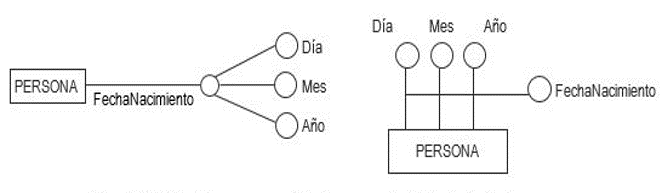

2. 🔢 *Atributos monovaluados y atributos multivaluados*  
    - Un atributo es monovaluado si admite, para cada elemento de la entidad, un solo valor; por ejemplo, el **nombre** de una persona.  
    - Si un atributo admite una lista de valores para cada elemento, sería multivaluado; por ejemplo, si un atributo de la entidad **CLIENTE** fuese **teléfono_cliente**, éste podría ser multivaluado.

    

3. ⚠️ *Atributos obligatorios y atributos opcionales*  
    - Un atributo es **obligatorio** si para todo elemento debe contener algún valor, y es **opcional** si puede haber elementos que no tengan asignado ningún valor para ese atributo. Por ejemplo, el atributo **Aficiones** podría ser opcional para una entidad **CLIENTE**.  
    - Un atributo opcional se representa:

    

4. 🧮 *Atributos derivados y no derivados*  
    - Un atributo es **derivado** si se puede obtener a partir de los datos contenidos en otros atributos. Por ejemplo, **IMPORTE DE VENTA** si se obtiene de **UNIDADES VENDIDAS** × **PRECIO UNIDAD** (no es recomendable abusar de atributos derivados).  
    - Un atributo es **no derivado** si su valor no depende de ningún otro atributo.

5. 🔑 *Atributo Clave*  
    Una **clave** sirve para identificar de forma única a cada elemento de una entidad. Puede estar formada por uno o varios atributos y no permite valores repetidos ni puede estar sin valor o vacío. En una entidad puede haber dos tipos de clave:  
    - **Clave primaria o principal**: entre los posibles conjuntos de atributos que identifican a los elementos, debería ser la más adecuada por **simplicidad**, **longitud**, **representatividad** y **estabilidad**.  
    - **Clave secundaria o alternativa**: puede haber varias en una entidad, pero no se debe abusar de ellas. Son todas aquellas que decidamos aparte de la primaria.

**Representación de los distintos tipos de atributos:**

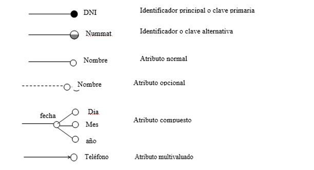

**Observa y analiza el siguiente ejemplo:**  
Indica para cada atributo de qué tipo es, haciendo un examen lo más exhaustivo posible. Indica para cada campo si es **obligatorios/opcionales**, **compuestos/simples**, **derivado/no derivado**, **monovaluado/multivaluado**.

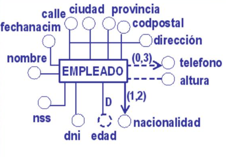

### 2.3.- 🔗 Relaciones

Una **relación** es una asociación entre varias entidades a través de una acción realizable entre ellas. Los podemos localizar en los enunciados de los ejercicios porque suelen representarse con **verbos o formas verbales**.  

Ejemplos:  
- COMPRAR (entre CLIENTE y PRODUCTO)  
- CURSAR (entre ALUMNO y MÓDULO)  
- SER_HIJO (entre ALUMNO y PADRE)  
- SER_JEFE (EMPLEADO consigo misma)  
- COMPRAR (entre CLIENTE, PRODUCTO)  

#### 🟦 Tipos de relaciones

1. **Relación binaria o de grado dos**: Cuando se da entre **dos entidades**.  

   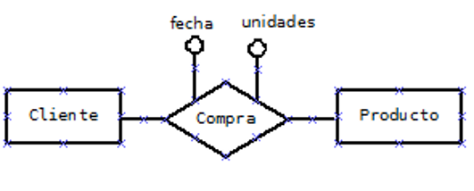  

   En este ejemplo vemos que las relaciones también pueden tener **atributos**.  Lo veremos con detalle más adelante.

2. **Relación unaria, reflexiva o de grado uno**:  Cuando se da entre **elementos de la misma entidad**, es decir, un elemento se relaciona con uno o más elementos de la misma entidad.  

   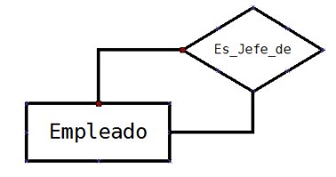  

3. **Relación ternaria o de grado tres**:  Cuando se da entre **tres entidades**.  Nosotros no vamos a utilizarlas, en principio. Una relación ternaria siempre se puede sustituir por dos relaciones binarias. Son más sencillas de entender.

   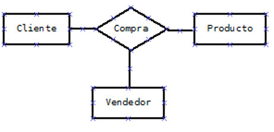  

### 2.4.- 🔢 Cardinalidad

En este apartado veremos una serie de definiciones clave para seguir entendiendo cómo construir un **diagrama E-R**.  

- **Ocurrencia**: es una unidad del conjunto de elementos que representa una entidad.  
  👉 Para la entidad **ALUMNO**, una ocurrencia sería un alumno concreto.  

- **Cardinalidad**: de una entidad **A** respecto de otra **B** en una relación, indica el **número mínimo y máximo de ocurrencias** de la entidad A que pueden estar relacionadas con una ocurrencia de la entidad B.  
  (A veces aparece como *participación* en lugar de *cardinalidad*).  

La cardinalidad se indica mediante una **pareja de números entre paréntesis**:  
- El **primer número** indica el mínimo (0 o 1).  
- El **segundo número** indica el máximo (1 o N, para muchos).  

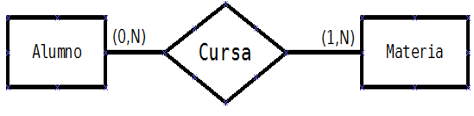

#### ❓ Preguntas para obtener mínimos y máximos

Pensando en la imagen anterior:

- ¿Cada alumno, como mínimo, cuántas materias puede cursar?  
  👉 **1**, ya que si no, no estaría matriculado.  

- ¿Cada alumno, como máximo, cuántas materias puede cursar?  
  👉 **N**, ya que puede cursar más de una.  

- ¿Cada materia puede ser cursada como mínimo por cuántos alumnos?  
  👉 **0**, ya que podría haber una materia sin alumnos (convalidada).  

- ¿Cada materia puede ser cursada como máximo por cuántos alumnos?  
  👉 **N**, ya que puede haber varios alumnos matriculados en ella.  

  
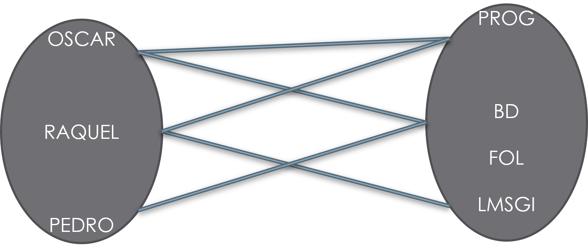  

📌 **Nota**: lo obtenido de las **2 primeras preguntas** se coloca al otro lado de la relación en **Materia**, y las **2 últimas en Alumno**.  

#### 📊 Tipos de cardinalidad en relaciones

| Cardinalidad | Significado |
|--------------|-------------|
| (0,1)        | Mínimo cero, máximo uno |
| (1,1)        | Mínimo uno, máximo uno |
| (0,N)        | Mínimo cero, máximo muchos |
| (1,N)        | Mínimo uno, máximo muchos |

### 2.5.- 🔄 Tipo de Correspondencia

El tipo de correspondencia o relación de cardinalidad expresa el número máximo de elementos u ocurrencias que se pueden llegar a relacionar entre las entidades de una relación.

- Uno a uno (1:1): Sería el caso de la relación **CASADO** entre las entidades PERSONA y PERSONA. Una persona podrá estar casada con otra persona pero no con muchas.  
- Uno a muchos (1:N): Sería el caso de la relación **PERTENECE** entre las entidades MUNICIPIO y PROVINCIA. Un municipio sólo puede pertenecer a una provincia, mientras que a una provincia pertenecen muchos municipios.  
- Muchos a muchos (N:M): Sería el caso de la relación **COMPRA** entre las entidades PRODUCTOS y CLIENTES. Un cliente puede comprar varios productos y un mismo tipo de producto será comprado por varios clientes.  

**Representación de cardinalidad y tipo de correspondencia**  

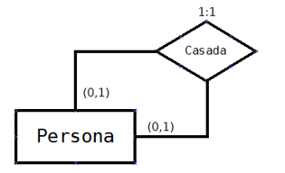  
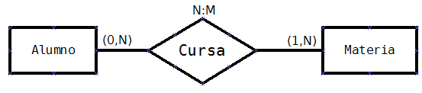  

**Realiza el siguiente ejercicio:**  

1. En un supermercado hay productos organizados en categorías. Cada producto pertenece a una única categoría. Están previstas categorías que aún pueden no tener productos. Calcula las cardinalidades de cada entidad y el tipo de correspondencia y represéntalos en el esquema E/R.

#### 📝 HOJAS DE EJERCICIOS

💻 Hoja de ejercicios 1.  

### 2.6.- 🏛️ Debilidad

Una entidad es **débil** frente a otra que es **fuerte** cuando para existir un elemento de la débil es necesario que exista un elemento de la fuerte.  

Por ejemplo, en la gestión de pedidos y ventas de un comercio, un pedido consta de varias líneas de pedido (una por cada producto).  
Si **PEDIDO** es una entidad y **LINEA_PEDIDO** es otra entidad, **PEDIDO** sería entidad fuerte y **LINEA_PEDIDO** una entidad débil respecto de la anterior.  

Una entidad débil solo se da en una relación de 1:N.  

En el ejemplo expuesto, para identificar la línea de pedido, además de su campo **id_línea**, necesito el **id_pedido**.  

Las entidades débiles se representan en los diagramas E/R **rodeadas por una línea doble**:  

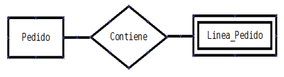  

Hay dos tipos de dependencias en relaciones de debilidad:  

1.- **Dependencia en existencia**: Las ocurrencias de una entidad débil no tienen ningún sentido en la base de datos sin una ocurrencia de la entidad fuerte con la que están relacionadas.  

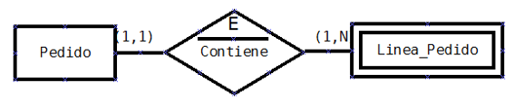  

2.- **Dependencia en identificación**: Además de la dependencia en existencia, la entidad débil necesita a la fuerte para poder crear una clave a partir de la clave que tiene la entidad fuerte.  
Por ejemplo, cada línea de pedido se identificaría con **numPed** y **numLinea**.  

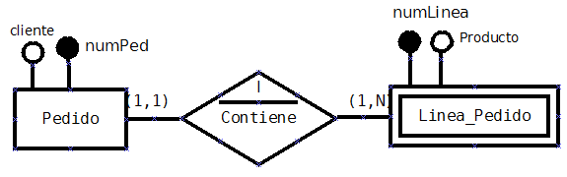  

#### 📝 HOJAS DE EJERCICIOS

💻 Hoja de ejercicios 2.  
💻 Hoja de ejercicios 3.  
💻 Hoja de ejercicios 4.  

## 3.- 🏗️ EL MODELO E/R AMPLIADO

El **Modelo E/R ampliado** recoge todos los conceptos y especificaciones del modelo E/R y añade otros para mejorar el diseño de las bases de datos. Se definen los siguientes conceptos dentro de este modelo:

- **Superclase**: Es una entidad genérica de la que derivan otras entidades. La superclase tiene unos atributos que van a tener también las entidades que derivan de ella.  

- **Subclase**: Es una entidad que deriva de una entidad genérica o superclase. La subclase va a tener los atributos de la superclase más unos atributos específicos. Los elementos que hay en la subclase también estarán en la superclase, aunque esta contendrá normalmente muchos más elementos.  

  Por ejemplo, **EMPLEADO** sería una superclase y **OPERARIO** y **ENCARGADO** serían subclases de ésta. Otro ejemplo, en un centro de estudios, **PERSONA** podría ser una superclase mientras **ALUMNO** y **PROFESOR** serían subclases.

- **Generalización**: es el proceso de construir una superclase a partir de las características comunes o que comparten varias subclases del sistema de información.  

  Una generalización se representa mediante un **triángulo invertido** que une la superclase y las subclases.  

  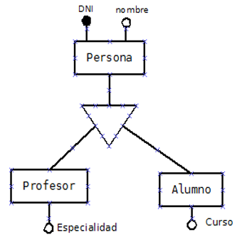  

- **Especialización**: es el proceso inverso a la generalización. En la especialización se trata de buscar los **atributos específicos de las subclases** y las **restricciones de existencia** de elementos de las entidades.  

Conforme a las restricciones de existencia de elementos de las entidades, nos podemos encontrar con los siguientes tipos de especialización o generalización:

1. **Especialización exclusiva total**: Por ser exclusiva, un elemento de la superclase sólo puede estar en una subclase. Por ser total, todos los elementos de la superclase están en alguna de las subclases.  

     

2. **Especialización exclusiva parcial**: Por ser exclusiva, un elemento de la superclase sólo puede estar en una subclase. Por ser parcial, no tienen por qué estar todos los elementos de la superclase en alguna de las subclases.  

     

3. **Especialización solapada total**: Por ser solapada, un elemento de la superclase podría pertenecer a varias subclases. Por ser total, todos los elementos de la superclase están en alguna de las subclases.  

     

4. **Especialización solapada parcial**: Por ser solapada, un elemento de la superclase podría pertenecer a varias subclases. Por ser parcial, no tienen por qué estar todos los elementos de la superclase en alguna de las subclases.  

     

Las **cardinalidades de la especialización** para los cuatro casos que hemos visto son de la siguiente manera:  

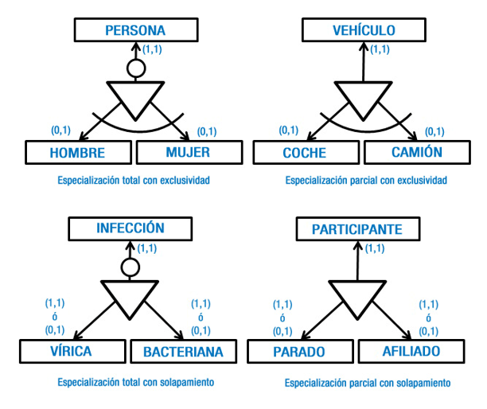  

#### 📝 HOJAS DE EJERCICIOS

💻 Hoja de ejercicios 5.  
💻 Hoja de ejercicios 6.  

## 4.- 🛠️ CONSTRUCCIÓN DE UN DIAGRAMA E/R

Los pasos a seguir serán:

1. Leer el documento varias veces hasta entender bien el problema y tener clara toda la información de que disponemos.  

2. Obtener una lista de candidatos a entidades, relaciones y atributos:  
    - Identificar las entidades: los sujetos básicos en el sistema.  
    - Buscar los atributos de cada entidad. Proponer la clave principal de cada uno. Establecer los tipos de atributos (compuestos, multivaluados, opcionales, derivados). Establecer sus dominios (Fecha, número real con dos decimales, cadena de caracteres de longitud 9, V/F…).  
    - Identificar las generalizaciones y especializaciones (tipos de especializaciones: exclusiva total, solapada parcial…).  
    - Identificar las relaciones de debilidad, entidades fuertes y débiles. Dependencias de existencia o de identificación.  

3. Averiguar las cardinalidades y los tipos de correspondencia en cada relación.  

4. Revisar lo obtenido para:  
    - Eliminar entidades derivadas.  
    - Ver si es necesario añadir entidades a alguna relación.  
    - Ver si algunos atributos de una entidad se deben agrupar como atributos de una nueva entidad.  

5. Realizar una distribución de las entidades y representar sus relaciones en el diagrama, así como los atributos.  

6. Volver a leer el problema para ver si nos hemos dejado algo. Revisar que toda la información está representada en el esquema y refinarlo si es necesario.  

#### 📝 HOJAS DE EJERCICIOS

💻 Hoja de ejercicios 7.  

---

## 5.- 🗄️ MODELO RELACIONAL

El **modelo relacional** es el más apropiado en la actualidad para representar la estructura de una base de datos. Esto se debe a:

- Es un modelo sencillo, potente y flexible para el diseño de una base de datos.  
- Tiene una base matemática en el álgebra relacional. Cualquier operación sobre elementos del modelo relacional deriva en una operación del álgebra relacional.  
- A partir de este álgebra relacional se ha podido realizar la construcción del lenguaje **SQL** para manipular los datos.  
- La mayoría de los SGBD relacionales se basan en este modelo.  

### 5.1.- 📋 Elementos de una relación

El elemento principal del modelo relacional es la **RELACIÓN**. Una relación es una **tabla**. Cada elemento de la relación es una **fila**, denominada **tupla**. Cada propiedad, atributo o característica de los elementos es una **columna**.  

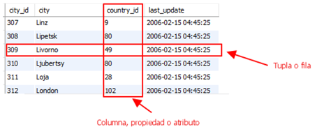  

No debes confundir el concepto de relación en el modelo relacional con el concepto de relación en el modelo E/R.  

Al conjunto de valores que puede tomar una columna se le denomina **dominio**, y estos pueden ser de dos tipos:  

- **General**: si los valores pueden ser todos los existentes dentro del tipo de dato correspondiente a la columna.  
- **Restringido**: si sólo puede tomar valores dentro de un rango de un dominio general, por ejemplo, números reales comprendidos entre 0 y 10.  

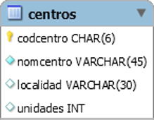  

### 5.2.- ⚖️ Restricciones del modelo relacional

Los datos que almacenan las BD tienen como objetivo fundamental representar situaciones del mundo real. En ocasiones esto no es así.  

Supongamos, por ejemplo, el caso de una relación **empleados** en la que su sueldo es negativo (-1000 euros). Esto hace necesaria la creación de **restricciones** que nos permitan representar de manera coherente dicha información.  

Existen dos tipos de restricciones:  

- **Propias o inherentes al modelo relacional**: son condiciones más generales, propias de un modelo de datos, y se deben cumplir en toda base de datos que siga dicho modelo.  
    - No puede haber dos tuplas o filas que tengan el mismo contenido en todas sus columnas.  
    - Ninguna columna que sea clave primaria (restricción de usuario) admite nulos.  
    - Ninguna columna que sea clave primaria admite valores repetidos en las tuplas.  
    - Ninguna columna que sea clave alternativa admite valores repetidos en las tuplas.  

- **Propias del usuario**: son condiciones específicas de una base de datos concreta, es decir, son las que se deben cumplir en una base de datos particular con unos usuarios concretos, pero que no son necesariamente relevantes en otra base de datos. Por ejemplo, tener empleados con sueldo negativo. En otra BD, puede que no haya sueldo, o que sea siempre positivo.  
  El modelo permite que el usuario establezca:  
    - **Clave primaria** (Primary Key)  
    - **Unicidad o clave alternativa** (UNIQUE)  
    - **Obligatoriedad** (NOT NULL)  
    - **Clave ajena** (FOREIGN KEY)  
    - **Verificación o chequeo** (CHECK)  
    - **Aserciones o asertos** (ASSERTION)  
    - **Disparadores** (TRIGGER)  

  
### 5.3.- 🔑 Claves primarias y claves ajenas

La **Clave primaria o principal (PRIMARY KEY)** es un conjunto de atributos o columnas que identifican de forma única a cada tupla de una relación (a cada fila de una tabla).  

Se debe declarar clave primaria en cualquier tabla, aunque no es obligatorio hacerlo.  

Sólo puede definirse una clave primaria en una tabla y debe ser, dentro de las columnas que puedan servir para identificar a cada tupla, la columna o el conjunto de columnas que se considere mejor para identificar de forma única a cada tupla o elemento de la tabla.  

Sobre las claves primarias quedan establecidas las restricciones inherentes comentadas anteriormente (que no puede estar vacía y que no se puede repetir).  

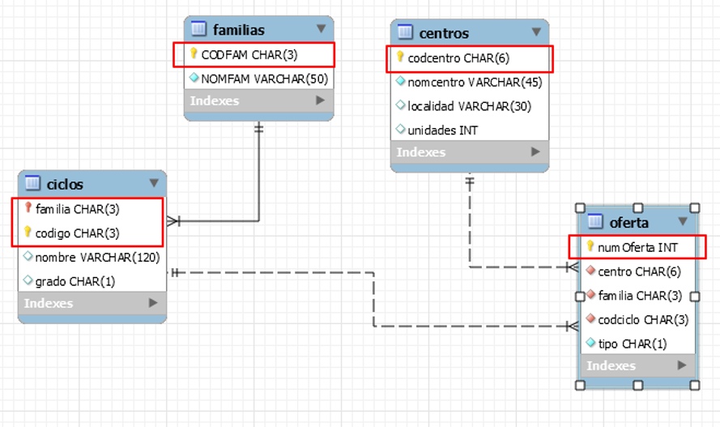  

**Nota:** En este esquema, la línea continua representa una relación identificada. La clave ajena forma parte de la clave primaria de la tabla donde está. La línea discontinua representa una relación no identificada. La clave ajena no forma parte de la clave primaria de la tabla donde está.  

La **clave ajena (FOREIGN KEY)** sirve para indicar que uno o más atributos que forman clave ajena en una tabla (tabla secundaria en la relación, referenciante) están relacionados con uno o más atributos de otra tabla (principal en la relación, referenciada) que forman clave primaria o clave alternativa en esa otra tabla.  

Por ejemplo, si tenemos una tabla **COUNTRY** que contiene datos de todos los países del mundo y una tabla **CITY** que contiene datos de ciudades del mundo, para controlar el país al que pertenece cada ciudad, podrá haber una relación de clave ajena entre:  

- **CITY** (tabla secundaria)  
- **COUNTRY** (tabla principal)  

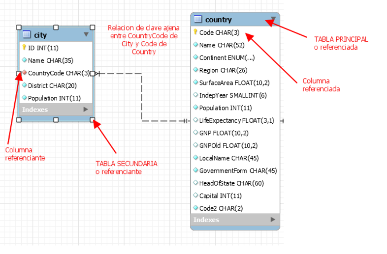  

### 5.4.- 🛡️ Integridad referencial

Las **restricciones de integridad referencial** permiten que el SGBD controle incoherencias entre los datos cargados en la clave ajena y los datos existentes en la clave primaria de la tabla principal.  
Estas restricciones actúan cuando:  

- **Se inserta una nueva fila en la tabla secundaria**  

  

Al insertar una nueva **CITY**, se comprobaría que el **CountryCode** de la nueva ciudad esté cargado en **Code** de algún **COUNTRY**. Si no lo está, se rechaza la inserción.  

- **Se modifica el valor de la clave ajena en la tabla secundaria**  

  

Al modificar el contenido de una **CITY**, se comprueba que el nuevo valor cargado en la clave ajena **CountryCode** exista en la clave primaria **Code** de la tabla principal **COUNTRY**. Si no existe, se rechaza la modificación y queda la fila con el valor anterior.  

- **Se borra una fila en la tabla principal**. En este caso, podemos definir diferentes restricciones de integridad referencial.  

  

  - **Borrado en cascada (BC)**: Si se elimina un país, se eliminan todas las ciudades del país.  
  - **Borrado restringido (BR)**: Si se trata de eliminar un país y hay ciudades de ese país en la tabla CITY, no se permite la eliminación.  
  - **Borrado con puesta a nulos (BN)**: Si se trata de eliminar un país y hay ciudades de ese país en la tabla CITY, se elimina el país y en la columna clave ajena (**countrycode**) de CITY de todas las ciudades de ese país, se carga NULL.  
  - **Borrado con puesta a valor por defecto (BD)**: Si se trata de eliminar un país y hay ciudades de ese país en la tabla CITY, se elimina el país y en la columna clave ajena (**countrycode**) de CITY de todas las ciudades de ese país, se carga un valor por defecto.  

- **Se modifica la clave primaria en la tabla principal**. Al igual que en el caso anterior, también se pueden definir diferentes restricciones de integridad referencial.  

  

  - **Modificación en cascada (MC)**: Si se modifica el código de un país, se modifica **countrycode** de todas las ciudades del país.  
  - **Modificación restringida (MR)**: Si se trata de modificar el código de un país y hay ciudades de ese país en la tabla CITY, no se permite la modificación.  
  - **Modificación con puesta a nulos (MN)**: Si se trata de modificar el código de un país y hay ciudades de ese país en la tabla CITY, se carga NULL en la columna clave ajena (**countrycode**) de CITY de todas las ciudades de ese país.  

### 5.5.- 🖼️ Representación del modelo Relacional

Existen diversas formas de representar el modelo relacional. Veamos ejemplos de algunas de ellas:

1. **Esquema relacional conectado a columnas**  

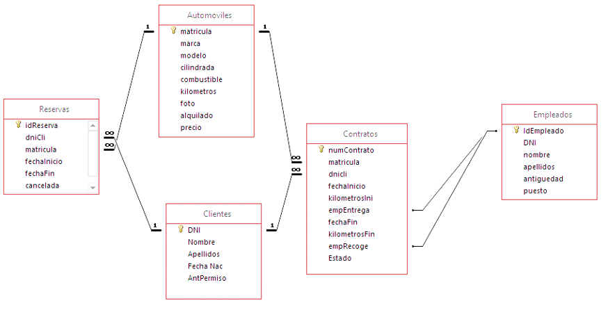  

2. **Esquema relacional crow's foot o pata de cuervo**  
La parte de la pata va en la tabla donde está la clave ajena.  

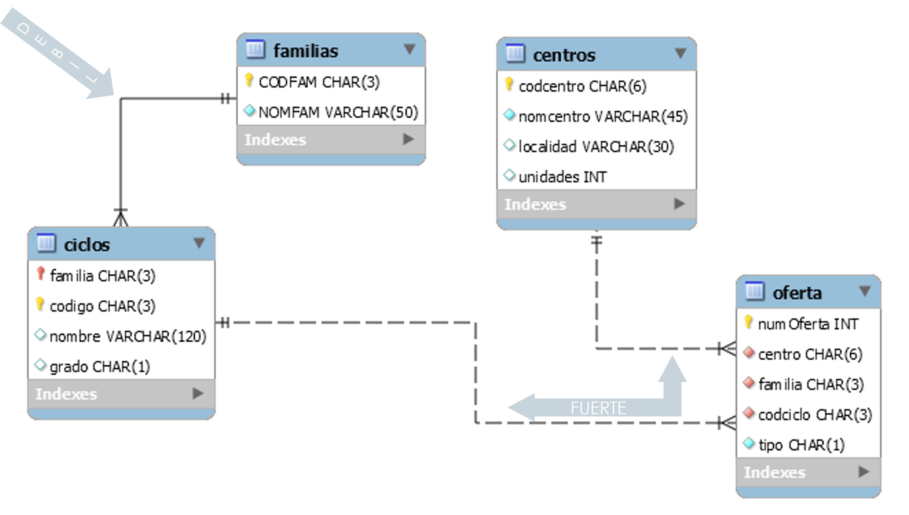  

3. **Grafo relacional**  

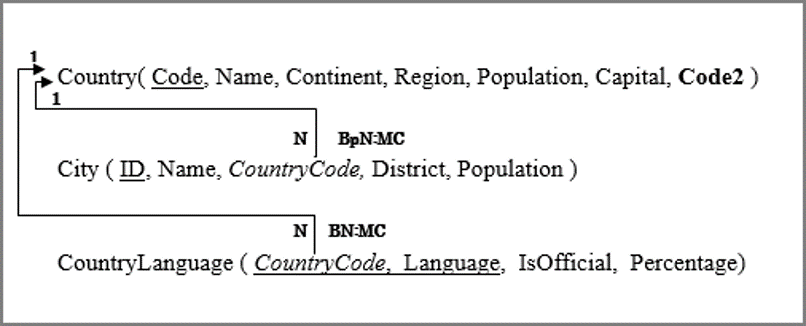  

Veamos ahora cómo se construye un grafo relacional:  

- Cada nodo representa una tabla o relación con todos sus atributos.  
- Se representan las claves ajenas a través de flechas dirigidas entre la clave ajena y la tabla que contiene la clave primaria relacionada.  
- Cada nodo se representa con una línea de texto: nombre de la tabla en mayúsculas seguido de los atributos entre paréntesis.  
  - Clave primaria: subrayada  
  - Clave alternativa: en negrilla  
  - Atributos que pueden ser nulos: asterisco al final  
  - Clave ajena: cursiva  

Ejemplo:

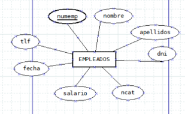  
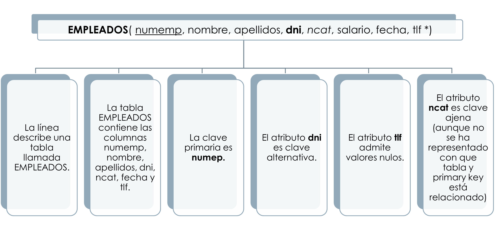  

- Para representar la relación de la clave ajena:  
  - Flecha desde la clave ajena hasta la tabla relacionada.  
  - Se escriben restricciones de borrado y modificación si se establecen.  
  - Se representa la cardinalidad (1:N → 1 en tabla principal, N en origen).  
- En el modelo relacional **no se permite N:M**, solo 1:1 y 1:N.  

Ejemplo:

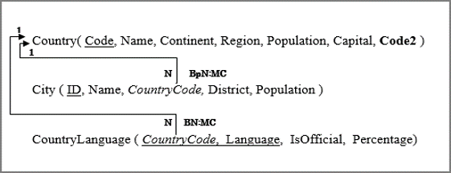  

**Caso práctico:**  
En la tabla **CountryLanguage**, la columna **CountryCode** es clave ajena y se relaciona con la primary key de **Country**. Por cada país puede haber varias filas en CountryLanguage. Restricción de borrado normal (no se puede borrar un país con idiomas asociados) y modificación en cascada (si se cambia el código de un país, se actualiza en todas las filas de CountryLanguage).  

---

### 5.6.- 🔄 Paso del modelo E/R al modelo Relacional

Para convertir un modelo E/R a relacional, todo se reduce a **relaciones representadas por tablas**.  

- Para cada conjunto de **entidades fuertes A** → tabla con el mismo nombre y atributos del conjunto.  
- Para cada conjunto de **entidades débiles B** → tabla con los atributos de B + atributos de clave primaria de la entidad fuerte correspondiente.  
- Para cada conjunto de **relaciones** → tabla con claves primarias de todas las entidades relacionadas + atributos propios de la relación.  

**Pasos detallados:**  

* Toda entidad se transforma en una tabla con los mismos atributos, excepto los multivaluados.  

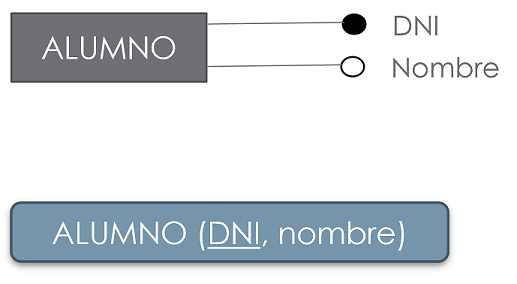  

* Relación 1:N → Propagar clave primaria de la entidad con participación 1 como clave ajena en la tabla con N.  

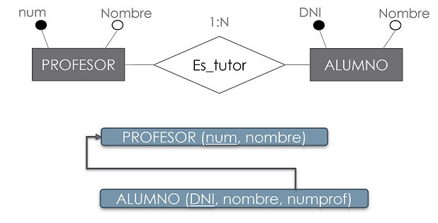  

* Relación N:M → Tabla con clave primaria concatenada de las tablas A y B + atributos de la relación.  

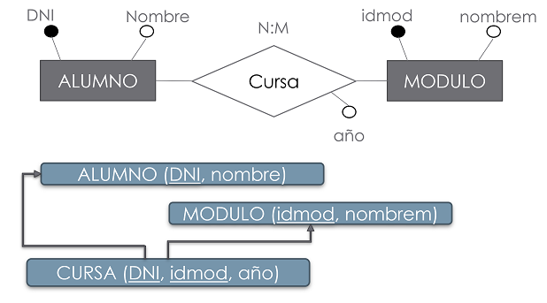  

* Relación 1:1 → Tres casos:  
  - A (0,1) y B (1,1) → clave primaria de B como clave ajena en A.  

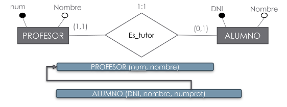  

  - A (1,1) y B (1,1) → propagar clave primaria de cualquiera de las dos tablas como clave ajena de la otra.  
  - A y B (0,1) → tratar como N:M.  

* Atributo multivaluado → Tabla con dos atributos: clave de la entidad + atributo correspondiente. Clave primaria concatenada o un identificador nuevo.  

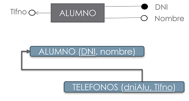  

* Dependencia en existencia → Propagar clave primaria de entidad fuerte como clave ajena en la entidad débil.  

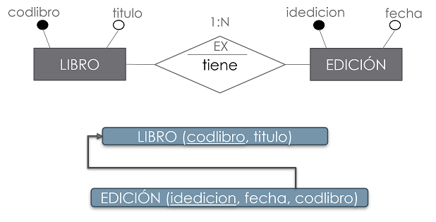  

* Dependencia en identificación → Propagar clave primaria de entidad fuerte como clave ajena en entidad débil. Clave primaria = concatenación de la clave ajena y el identificador de la entidad débil.  

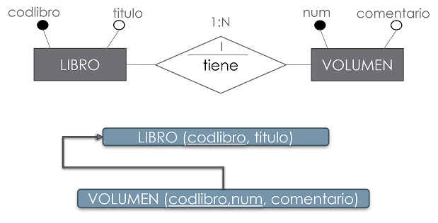  

* Especialización → Tres modos:  
  - **Modo 1:** tabla superentidad + tabla por cada subentidad con referencia a superentidad. Funciona siempre.  

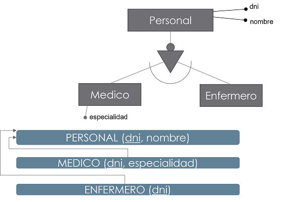  

  - **Modo 2:** tabla por cada subentidad con referencia a superentidad. Funciona si especialización total.  

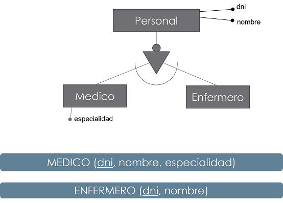  

  - **Modo 3:** una tabla con todos los atributos de superentidad y subentidades + atributo tipo. Puede generar nulos. No recomendada.  

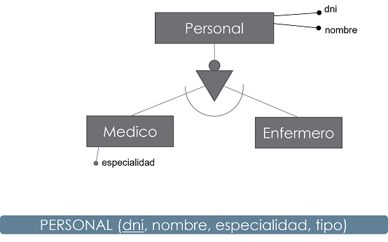  

📄 Documento resumen de conversión E-R → Relacional:  
[Resumen](ConversionER-Relacional.pdf)  

**Realiza el siguiente ejercicio:**

1. Representa el esquema relacional correspondiente a una base de datos sobre la red de albergues del Camino de Santiago del Norte.  
- De cada albergue se registrará su nombre, dirección, localidad y km que faltan para el destino final (Santiago de Compostela).  
- Existen albergues con el mismo nombre genérico (Albergue de peregrino, por ejemplo).  
- Los albergues son de propiedad municipal y pertenecen a Ayuntamientos. Un determinado Ayuntamiento puede disponer de varios albergues.  
- De cada Ayuntamiento debemos conocer su nombre, dirección, teléfono y URL de su web.  
- En los albergues pernoctan peregrinos, de los que se registra un número de tarjeta (único), su nombre y nacionalidad.  
- Se debe registrar la fecha de entrada de cada peregrino en el albergue correspondiente.  

#### HOJAS DE EJERCICIOS

💻 Hoja de ejercicios 8.  
💻 Hoja de ejercicios 9.  
💻 Hoja de ejercicios 10.  
💻 Hoja de ejercicios 11.  
💻 Hoja de ejercicios 12.  
💻 Hoja de ejercicios 13.  
💻 Hoja de ejercicios 14.  

## 6.- 🧩 NORMALIZACIÓN

Al diseñar una base de datos se ha de evaluar la calidad del diseño. Para ello, uno de los parámetros que se utiliza son las **formas normales** en las que se encuentra dicho diseño.  
Se llama **normalización** al proceso de obligar a los atributos incluidos en el diseño a cumplir varias formas normales.

Las formas normales son reglas que aseguran que el esquema tenga buen comportamiento respecto a:

- Redundancia de información  
- Pérdida de información  
- Presentación de la información  

**Ejemplo:** tabla Suministros

| CodProv | CodArticulo | Cantidad | CiudadProv |
|---------|------------|---------|------------|
| P1      | C1         | 12      | Cantabria  |
| P1      | C2         | 25      | Cantabria  |
| P1      | C3         | 11      | Cantabria  |
| P2      | C1         | 52      | Valencia   |
| P2      | C2         | 35      | Valencia   |
| P3      | C5         | 22      | Valladolid |

Esta tabla presenta redundancia y posibles anomalías:

1. **Anomalías de modificación:** si un proveedor cambia de ciudad, hay que modificar todas las tuplas que lo contengan.  

2. **Anomalías de borrado:** si un proveedor deja de suministrar artículos, se pierden sus datos.  

3. **Anomalías de inserción:** si queremos añadir un proveedor sin artículos, tendríamos que poner NULL en columnas de clave primaria, rompiendo la integridad referencial.

El origen de estas anomalías: la tabla Suministros describe dos hechos diferentes: los artículos que suministra cada proveedor y el proveedor en sí, que son independientes, aunque se relacionen indirectamente.

Si la BD se diseña usando un modelo semántico (E/R), la normalización suele ser menos necesaria.  

En bases de datos relacionales, las **formas normales (FN)** indican el grado de vulnerabilidad de una tabla a inconsistencias y anomalías. Cada FN incluye a las anteriores.

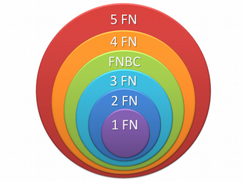  

**Definiciones previas:**

- Dependencia funcional: A → B. Para cada valor de A hay un único valor de B.  
- Dependencia funcional completa: B depende de toda la clave A.  
- Dependencia transitiva: A → B → C. C depende transitivamente de A.  
- Determinante funcional: atributo del que depende otro.  
- Dependencia multivaluada: A →→ B. Un valor de A implica varios valores de B.

### 6.1.- 1FN (Primera forma normal)

Una relación está en 1FN si cada atributo es atómico, es decir, cada celda contiene un solo valor.  

**Ejemplo:** tabla de pedidos de clientes

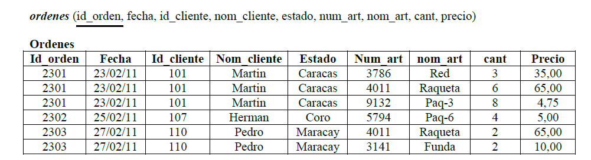  

Se observa que la tabla no está en 1FN, ya que hay campos repetidos: Num_art, Nom_art, Cant y Precio.  

Solución: crear una nueva tabla con estos campos y su clave primaria, dejando la tabla original con la clave primaria de la orden:

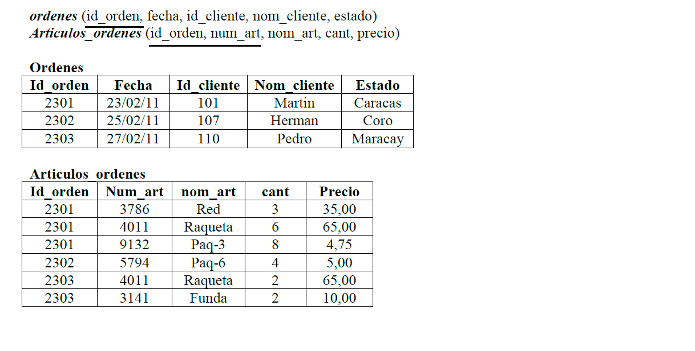  

### 6.2.- 2FN (Segunda forma normal)

Una relación está en 2FN si está en 1FN y todos los atributos no clave dependen funcionalmente de la **clave completa**.  

Ejemplo: seguimos con la tabla en 1FN:

- Identificar columnas que dependen solo de parte de la clave primaria.  
- Crear una nueva tabla con estas columnas, usando como clave primaria la de la que dependen.  

Si la clave primaria solo tiene un campo, la tabla ya está en 2FN.  

En nuestro ejemplo:  

- Tabla **Ordenes** → clave principal Id_orden (ya está en 2FN).  
- Tabla **Articulos_Ordenes** → Nom_art y Precio dependen solo de Num_art → se crean tabla **Articulos** con estas columnas + Num_art como clave primaria.

Resultado final:

  
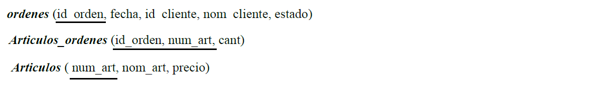  

Tablas en 2FN:

- Ordenes (clave principal Id_orden)  
- Articulos_Ordenes (clave principal Id_orden, Num_art)  
- Articulos (clave principal Num_art)  

### 6.3.- 3FN (Tercera forma normal)

Una relación está en 3FN si y solo si está en 2FN y no existen **dependencias transitivas**.  
Todas las dependencias funcionales deben ser respecto a la clave principal.  

Es decir, debemos identificar atributos que dependen de otros atributos que **no** son clave principal.  

**Ejemplo:** seguimos con las tres tablas obtenidas en 2FN. Los pasos son:

- Determinar columnas dependientes de atributos que no son clave.  
- Eliminar esas columnas de la tabla base.  
- Crear una nueva tabla con esas columnas y la columna no clave de la cual dependen.

En nuestro ejemplo:  

- Tabla **Articulos** → ya está en 3FN.  
- Tabla **Articulos_Ordenes** → ya está en 3FN.  
- Tabla **Ordenes** → **no está** en 3FN, porque `nom_cliente` y `estado` dependen de `Id_cliente`, que no es clave primaria.

  

Para normalizar: mover columnas no clave y la columna dependiente a otra tabla llamada **Clientes**. Resultado:

  

El resultado final es:

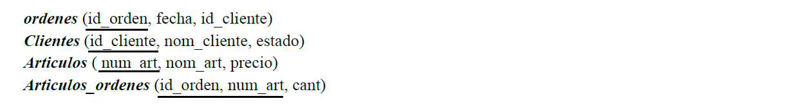  
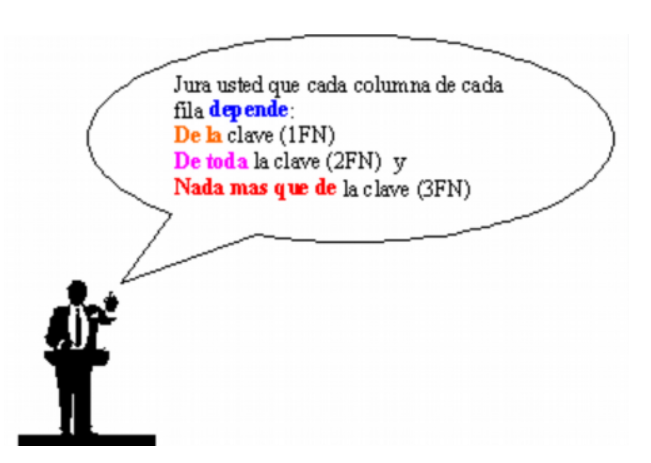  

> Nota: en clase trabajaremos hasta la 3FN.  
Si quieres profundizar en 4FN y 5FN, puedes consultar el siguiente enlace:  

[Wikipedia: Normalización de bases de datos](https://es.wikipedia.org/wiki/Normalizaci%C3%B3n_de_bases_de_datos)

#### HOJAS DE EJERCICIOS

💻 Hoja de ejercicios 15.  
💻 Hoja de ejercicios 16.  
💻 Hoja de ejercicios 17.  
💻 Hoja de ejercicios 18.  
💻 Hoja de ejercicios 19. REPASO DE TODO EL TEMA.
