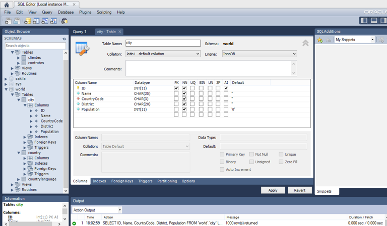
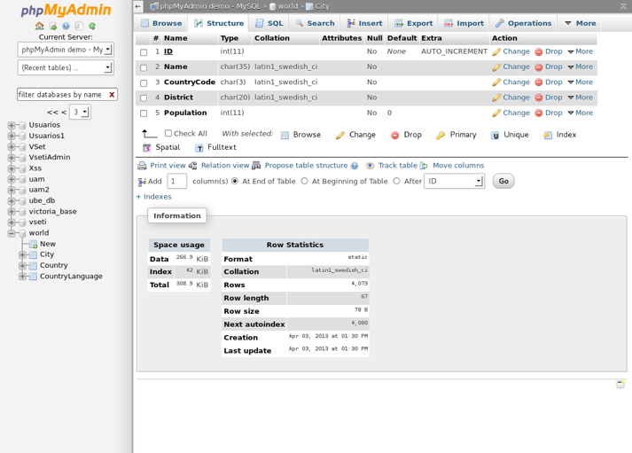
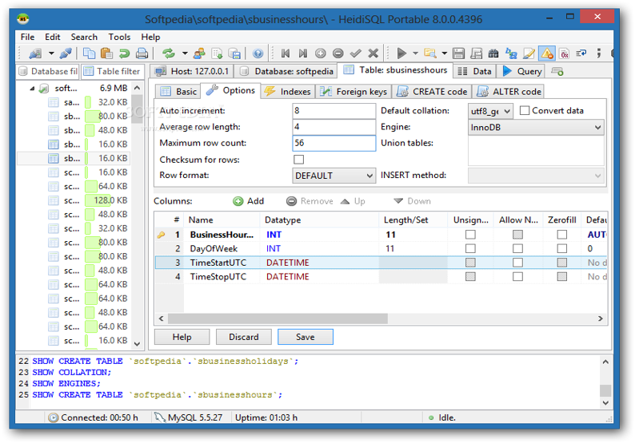
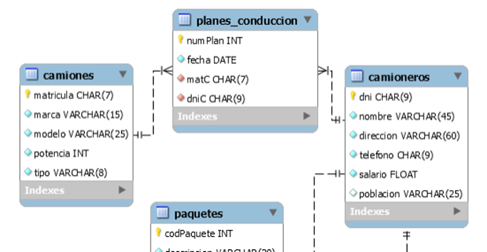

# UNIDAD 3. DISEÑO FÍSICO DE LA BASE DE DATOS.


# 1.- 🧱 CARACTERÍSTICAS DEL DISEÑO FÍSICO

El **diseño físico** se realiza a partir del **diseño lógico** (*grafo relacional*).  
Consiste en definir todas las **instrucciones SQL necesarias** para implementar la base de datos en el **DBMS** (*Database Management System*).

1. Hay que **crear las tablas**, eligiendo un **nombre adecuado**. Se establecen los **tipos de tabla** y las **restricciones** correspondientes. Para cada tabla se definen las **columnas**, sus **nombres** y los **tipos de datos** que contienen.  
2. Se establecen las **restricciones necesarias** sobre las columnas de las tablas (`PRIMARY KEY`, `NOT NULL`, `UNIQUE`, `FOREIGN KEY`, etc.).  
3. Se **crean vistas**, que son **tablas virtuales** utilizadas para **simplificar búsquedas complejas**.  
4. Se **crean procedimientos**, **funciones** y **triggers**, que son objetos que se activan automáticamente cuando ocurre una determinada acción.  
5. Se establecen las **propiedades físicas** sobre las tablas, como el **motor de almacenamiento**, la **carpeta de almacenamiento**, el valor **AUTO_INCREMENT**, o las **particiones**.


# 2.- 🛠 HERREMIENTAS GRÁFICAS PARA LA IMPLEMENTACIÓN DE LA BASE DE DATOS

Vemos algunas de las herramientas gráficas gratuitas que podemos encontrar:

**MySQL Workbench**



**phpMyAdmin** (Requiere servicio Apache con motor PHP)



**HeidiSQL**




#### ✍️ Ejercicio

**Realiza el siguiente ejercicio:**

1. 🏗 Crea una base de datos **EmpTransportes** en MySQLWorkbench utilizando los iconos de la barra de herramientas.

    - ❓ ¿Cuál es la instrucción SQL para crear la base de datos?  
    - 🖱 Selecciona la nueva base de datos e identifica los **botones de la barra de herramientas** para añadir **tablas**, **vistas** y **rutinas**.

2. 🛠 Crea gráficamente en la base de datos **EmpTransportes** la **tabla camiones** y __copia la instrucción__ SQL de creación de la tabla.

3. ✏️ Abre una ventana para **editar y ejecutar instrucciones SQL**.  
   Edita la instrucción copiada para crear la **tabla camioneros**.




# 3.- 📄 EL LENGUAJE DE DEFINICIÓN DE DATOS (DDL)

Desde este momento comenzamos a usar el lenguaje **SQL (Structured Query Language)**, el estándar moderno para interactuar con sistemas de bases de datos relacionales.  

El **DDL (Data Definition Language)** es el subconjunto de SQL encargado de **definir y modificar la estructura de la base de datos**, incluyendo la creación, modificación y eliminación de tablas, índices, vistas y otros objetos.

Aunque SQL es un estándar ampliamente soportado por los SGBD modernos, no todas las instrucciones de DDL están necesariamente disponibles en todos los sistemas, y algunos SGBD incluyen extensiones propias. Por eso, al trabajar con diferentes plataformas, puede ocurrir que:

⚠️ Algunas instrucciones no estén implementadas.  
✨ Existan funcionalidades adicionales propias del SGBD.  
📝 La sintaxis de ciertas instrucciones pueda variar ligeramente.

### 🔍 Interpretación de la sintaxis de una instrucción SQL

Cuando nos dan la sintaxis completa de una instrucción SQL, por ejemplo en la documentación oficial de MySQL, tenemos algo como esto:

```sql
CREATE {DATABASE | SCHEMA} [IF NOT EXISTS] db_name [create_specification]  

Create_specification: 

[DEFAULT] CHARACTER SET [=] charset_name | [DEFAULT] COLLATE [=] collation_name
```

Es importante interpretarla correctamente para construir las instrucciones:
- 🆗 Las palabras en **mayúsculas** son **palabras reservadas SQL**.  
- ✏️ Las palabras en **minúsculas y cursiva** son **parámetros sustituibles** que decide el usuario (por ejemplo, `db_name`).  
- ⚪ Los elementos entre **corchetes [ ]** son **opcionales**.  
- 🔀 Los elementos entre **llaves { }** indican que hay que **elegir uno de los elementos** separados por `|`.  
- ➕ Los **puntos suspensivos** indican que podemos introducir una **lista de valores**.

### 🧩 Subconjuntos del lenguaje SQL

Según el tipo de operaciones realizadas, las instrucciones SQL se dividen en tres subconjuntos:

- **DDL (Data Definition Language)**: Instrucciones para **definir la estructura de los datos** y realizar el **diseño físico** de la base de datos.  
- **DML (Data Manipulation Language)**: Instrucciones para **manipular los datos** (consultar, insertar, modificar, eliminar).  
- **DCL (Data Control Language)**: Instrucciones para **controlar el acceso a los datos** (gestionar usuarios, privilegios, transacciones, bloqueos, etc.).

### 📝 Principales instrucciones del lenguaje DDL

- **CREATE** (DATABASE, TABLE, INDEX, VIEW, PROCEDURE, FUNCTION, TRIGGER, ...)  
- **ALTER** (DATABASE, TABLE, VIEW, PROCEDURE, FUNCTION, TRIGGER, ...)  
- **DROP** (DATABASE, TABLE, VIEW, PROCEDURE, FUNCTION, TRIGGER, ...)


# 4.- 🏗 CREACIÓN, MODIFICACIÓN Y ELIMINACIÓN DE BASES DE DATOS

La sintaxis de la instrucción para **crear una base de datos** es la siguiente:

```sql
CREATE {DATABASE | SCHEMA} [IF NOT EXISTS] db_name [create_specification]  

Create_specification: 

[DEFAULT] CHARACTER SET [=] charset_name | [DEFAULT] COLLATE [=] collation_name
```

En **MySQL** es lo mismo usar `DATABASE` o `SCHEMA`.

La cláusula `IF NOT EXISTS` hace que no se intente crear la base de datos si ya existe, evitando un **error de ejecución**.

`CHARACTER SET` permite especificar el **conjunto de caracteres**, es decir, cómo se codifican internamente los caracteres (utf8, latin1, etc.).

`COLLATE` establece los **criterios para ordenar y comparar datos alfabéticamente** (por ejemplo, `spanish_ci`).

#### ✍️ Ejercicio

**Realiza el siguiente ejercicio:**

1. Crea la base de datos **EmpTransportes** utilizando código SQL.  
2. Evita que la instrucción produzca error si **EmpTransportes** ya existe.


[Solución](#Soluciones)

Si queremos que la base de datos se cree para usar el conjunto de caracteres latin1 (en lugar de utf8 usado por defecto) y con ordenación alfabética para el español (por defecto, se usa general_ci):

```sql
    CREATE DATABASE IF NOT EXISTS EmpTransportes 
    CHARSET latin1 COLLATE latin1_spanish_ci;
```

La instrucción para **mostrar las bases de datos** montadas en el servidor es la siguiente:

```sql
    SHOW databases;
```

La sintáxis de la instrucción para **modificar una base de datos** es la siguiente:

```sql
    ALTER {DATABASE \| SCHEMA} [db_name] alter_specification;
    
    alter_specification: 
    
    [DEFAULT] CHARACTER SET [=] charset_name \| [DEFAULT] COLLATE [=] collation_name 
```

 La síntáxis de la instrucción para **eliminar una base de datos** es la siguiente:

```sql
     DROP {DATABASE | SCHEMA} [IF EXISTS] db_name;
```

 Para que podamos ejecutar instrucciones sobre una base de datos existente, es necesario tenerla en uso o abrirla:

```sql
	 USE  db_name;
```
#### ✍️ Ejercicio

**Realiza el siguiente ejercicio:**

1. Probamos las siguientes instrucciones en MySql Workbench:
    - Mostramos las bases de datos existentes:
```sql
    SHOW databases;
```
   - Utilizamos la BD emptransportes:
```sql
    USE emptransportes;
```
   - Mostramos las tablas de dicha base de datos:
```sql
    SHOW tables;
```

# 5.- 🔢 TIPOS DE DATOS, VALORES Y OPERADORES

Vamos a ver de forma resumida los **tipos de datos** que podemos usar en **MySQL** para las columnas de las tablas. Estos se pueden clasificar en:

- 🔢 **Numéricos**  
- 📝 **Cadenas de caracteres**  
- 💾 **Cadenas de bytes o binarias**  
- 📅 **Fecha y hora**  
- ✅ **Booleanos**  
- 📌 **Enumerados**  
- 📚 **Conjuntos**

### 🔹 Tipos de datos numéricos

| Tipo de dato | Rango de representación |
| ------------- | ------------- |
| **TINYINT**  | Enteros entre -128 y +127. Sin signo: 0 a 255. Ocupan 1 byte. | 
| **SMALLINT**  | Enteros entre -32768 y +32767. Sin signo: 0 a 65535. Ocupan 2 bytes. | 
| **MEDIUMINT**  | Enteros entre aproximadamente -8 millones y +8 millones. Sin signo: 0 a 16 millones. Ocupan 3 bytes. | 
| **INT, INTEGER** | Enteros entre aproximadamente -2 mil millones y +2 mil millones. Sin signo: 0 a 4 mil millones. Ocupan 4 bytes. | 
| **BIGINT**  | Enteros entre aproximadamente -10¹⁹ y +10¹⁹. Sin signo: 0 a 2x10¹⁹ | 
| **FLOAT**  | Reales en coma flotante de precisión simple (6 dígitos). Rango: negativos -3.4×10³⁸ a -1.2×10⁻³⁸, 0, positivos 1.2×10⁻³⁸ a 3.4×10³⁸ | 
| **DOUBLE, REAL** | Reales en coma flotante de precisión doble (12 dígitos). Rango: negativos -1.8×10³⁰⁸ a -2.2×10⁻³⁰⁸, 0, positivos 2.2×10⁻³⁰⁸ a 1.8×10³⁰⁸ | 
| **DECIMAL, NUMERIC** | Números en coma fija. Por defecto hasta 10 cifras enteras sin decimales. DECIMAL(M,D) permite definir M dígitos totales y D decimales. |

**Notas importantes:**

- Todos los enteros se pueden definir como `TIPO(N)`, donde **N** indica el número de cifras con que se presenta o edita el número.  
- Todos los reales se pueden definir como `TIPO(N,D)`, donde **N** indica el número total de cifras y **D** el número de decimales (0 a 24).  
- Todos los tipos numéricos admiten los modificadores **UNSIGNED** y **ZEROFILL**:  
  - **UNSIGNED**: entero sin signo.  
  - **ZEROFILL**: rellena con ceros las cifras no significativas hasta N cifras.  

### 💡 Ejemplos de definición de columnas

```sql
edad TINYINT UNSIGNED ZEROFILL
salario DECIMAL(10,2)
precio FLOAT(7,2) UNSIGNED
```

```sql
numPrimitiva TINYINT UNSIGNED;
numLoteria INT(5) UNSIGNED ZEROFILL;
pesoAtomico DOUBLE;
tempMedia DECIMAL(4,2);
precioUnidad FLOAT;
```
### 📝 Tipos de datos: cadenas de caracteres

| Tipo de dato | Rango de representación |
| ------------- | ------------- |
| **CHAR(N)**  | Cadena de longitud fija de N caracteres. Cualquier valor que se almacene ocupará lo correspondiente a N caracteres. Si se cargan menos caracteres, se rellena con espacios por la derecha. Admite hasta 255 caracteres. | 
| **VARCHAR(N)**  | Cadena de longitud variable hasta un máximo de N caracteres. Si se carga una cadena con menos caracteres, ocupará solo el espacio necesario. Admite hasta 65535 caracteres. | 
| **TINYTEXT**  | Similar a VARCHAR para cadenas de hasta 255 caracteres. | 
| **TEXT** | Similar a VARCHAR con algunas diferencias menores. Es más conveniente usar VARCHAR por compatibilidad con otros SGBD. Hasta 65535 caracteres. | 
| **MEDIUMTEXT**  | Similar a VARCHAR para cadenas de hasta 16 millones de caracteres. |
| **LONGTEXT**  | Similar a VARCHAR para cadenas de hasta 4 mil millones de caracteres. |

### 💡 Ejemplos de definición de columnas de tipos cadenas de caracteres

```sql
nombreCiclo VARCHAR(80),
dniProfesor CHAR(9);
codPostal CHAR(5);
signoQuiniela CHAR;  -- Equivalente a usar CHAR(1)
codPais CHAR(2);
argPelicula TEXT(500);   -- Se puede y es más recomendable usar VARCHAR(500)
```

### 💾 Tipos de datos: cadenas de bytes o binarias

Permiten almacenar **secuencias de bytes**, por ejemplo el contenido de ficheros. También pueden almacenar cadenas de texto, en cuyo caso la comparación diferencia entre mayúsculas y minúsculas.  
No es adecuado definir una columna para cargar en ella un fichero; para eso es mejor almacenar **el nombre y ubicación del fichero** en una columna de texto.

| Tipo de dato | Rango de representación |
| ------------- | ------------- |
| **BINARY(N)**  | Cadena de longitud fija de N bytes. Si se cargan menos caracteres se rellena con espacios por la derecha. Admite hasta 255 caracteres | 
| **VARBINARY(N)**  | Similar a `VARCHAR` para cadenas binarias. | 
| **TINYBLOB(N)**  | Similar a `TINYTEXT` para cadenas binarias. | 
| **BLOB(N)** | Similar a `TEXT` para cadenas binarias. | 
| **MEDIUMBLOB(N)**  | Similar a `MEDIUMTEXT` para cadenas binarias. |
| **LONGBLOB(N)**  | Similar a `LONGTEXT` para cadenas binarias. |

---

### 📅 Tipos de datos: fecha y hora

| Tipo de dato | Rango de representación |
| ------------- | ------------- |
| **DATE**  | Formato `'aaaa-mm-dd'`. Rango: 1000-01-01 hasta 9999-12-31. | 
| **TIME** | Formato `'hh:mm:ss'`. Rango: -838:59:59 hasta +838:59:59. | 
| **DATETIME** | Formato `'aaaa-mm-dd hh:mm:ss'`. | 
| **TIMESTAMP** | Formato `'aaaa-mm-dd hh:mm:ss'`. Rango: 1970-01-01 00:00:00 hasta 2037-12-31 23:59:59. Útil para registrar operaciones de inserción y modificación. Por defecto recibe la fecha y hora actuales. |

---

### ✅ Tipos de datos booleanos

- **BOOLEAN** representa valores **verdadero o falso**.  
- En realidad, es un `TINYINT(1)`: 0 = false, 1 = true.  
- Se puede usar indistintamente `0/false` y `1/true`, aunque se recomienda usar **false** y **true**.

---

### 📌 Tipos de datos enumerados

- **ENUM**: contiene un valor de un conjunto de textos definidos en la declaración.  
- Sintaxis: `ENUM('cad1', 'cad2', …, 'cadN')`  
Ejemplo para días de la semana:

```sql
Dia ENUM('lunes','martes','miercoles','jueves','viernes','sabado','domingo')
```
Internamente se almacenan los índices de los valores (1 al número de elementos).

Se pueden usar tanto los valores definidos como los índices.

Se ordenan por el índice.

### 📚 Tipos de datos conjuntos

**SET**: puede contener varios valores o ninguno de un conjunto de textos definidos en la declaración.

Sintaxis: `SET('cad1', 'cad2', …, 'cadN')`

Ejemplo para definir el formato de letra fuente en una columna:

```sql
	formato SET('negrilla','subrayado','cursiva')
```

Al insertar valores en una columna del tipo anterior podemos insertar:

```sql
		'negrilla'
		'cursiva'
		'negrilla,cursiva'
```

- Si se insertan dos o más valores de un **SET**, los valores deben escribirse respetando el **orden definido** en el conjunto.  
  - Ejemplo inválido: `'cursiva,negrilla'`.  
- Los valores no válidos que se intenten insertar se **ignoran**.  
- Para comprobar si un dato **SET** contiene un determinado grupo de valores se puede usar la función `FIND_IN_SET` o el operador `LIKE` adecuadamente.

---

### 📖 Representación de valores literales

- **Cadenas de caracteres**: entre comillas dobles `" "` o simples `' '`.  
  - Para incluir comillas dentro de la cadena se preceden con `\`.  
  - Caracteres especiales también se preceden con `\`.  
- **Datos numéricos**:  
  - Separador de parte entera y decimal: `.`  
  - Se pueden usar notación exponencial: `2.7562e+12`  
  - Se pueden usar valores hexadecimales precedidos de `0x`, por ejemplo: `0x3A24FF`  
- **Booleanos**: `true` o `false`  
- **Valores nulos**: `NULL`

---

### ⚙️ Operadores

#### 🔹 Operadores de comparación y pertenencia

- Igualdad / desigualdad: `=` `!=`  
- Mayor que / mayor o igual: `>` `>=`  
- Menor que / menor o igual: `<` `<=`  
- Es nulo / no es nulo: `IS NULL` `IS NOT NULL`  
- Pertenencia a un rango: `BETWEEN 1 AND 100`  
- Pertenencia a un conjunto: `IN(1,2,4,8)`

#### 🔹 Operadores lógicos

- **AND (Y lógico)**

```sql
	nota >=5 AND nota <=10
```
O lógico: OR
```sql
	nota>10 OR nota <0
```
Negación: NOT
```sql
	NOT(x>=5)
```

# 6.- 🗄 ADMINISTRACIÓN DE TABLAS

Las instrucciones **DDL** para administrar tablas permiten:

- 🆕 Crear una tabla con un nombre, definiendo sus columnas, tipos y restricciones.  
- ⚙️ Establecer propiedades de una tabla.  
- ✏️ Modificar la estructura de una tabla (añadir/eliminar columnas, modificar PRIMARY KEY, añadir FOREIGN KEY, etc.).  
- ❌ Eliminar una tabla.  
- 📌 Crear un índice.  
- 🗑 Eliminar un índice.  
- 🔄 Renombrar una tabla.

---

## 6.1.- 📄 Sintaxis de la instrucción CREATE TABLE

La instrucción SQL para crear una tabla es **CREATE TABLE**.  
La sintaxis completa es bastante compleja, y se puede consultar en la documentación oficial de MySQL:

[Documentación CREATE TABLE MySQL](https://dev.mysql.com/doc/refman/8.0/en/create-table.html)

Vamos a explicar la sintaxis de una forma más simple:

```sql
CREATE  [TEMPORARY] TABLE  [IF NOT EXISTS] nombre_tabla
(
	nombre_columna1   tipo   [restricciones_tipo_1],
	nombre_columna2	   tipo   [restricciones_tipo_1],
    ...
	[restriccion_tipo_2	],
	[restriccion_tipo_2	],
	...
)  [opciones_tabla];
```

### 🔹 Interpretación de la sintaxis de CREATE TABLE

1. **TEMPORARY**: la tabla solo existe durante la sesión. Al cerrar la sesión, se elimina automáticamente.  
2. **IF NOT EXISTS**: evita error si la tabla ya existe.  
3. Entre paréntesis se definen **columnas** (separadas por comas) y luego, si las hay, **restricciones de tabla**.  
4. Después de las columnas se pueden definir **opciones o propiedades** de la tabla; si no, se usan valores por defecto.  
5. En cada columna se indica **nombre, tipo y restricciones**:  
   - `PRIMARY KEY` (mejor no usar en la definición de columna)  
   - `UNIQUE`  
   - `NOT NULL`  
   - `DEFAULT valor`  
   - `AUTO_INCREMENT`  
   - `GENERATED ALWAYS AS (expresión)`  

6. **Restricciones de tabla**: se aplican a una o varias columnas:  
   - `CONSTRAINT [símbolo] PRIMARY KEY (columna1,...)`  
   - `INDEX [nombre] (columna1,...)`  
   - `CONSTRAINT [símbolo] UNIQUE [nombre] (columna1,...)`  
   - `FULLTEXT [nombre] (columna1,...)`  
   - `CONSTRAINT [símbolo] FOREIGN KEY (colAjena1,...) REFERENCES tblReferenciada (colReferenciada1,...) [ON DELETE opción] [ON UPDATE opción]`  

7. **FOREIGN KEY: comportamiento al modificar (ON UPDATE)**  
   - `RESTRICT` / `NO ACTION`: no permite modificar clave primaria si hay filas relacionadas.  
   - `CASCADE`: modifica automáticamente las claves ajenas relacionadas.  
   - `SET NULL`: pone a NULL las claves ajenas relacionadas al modificar la primaria.  

8. **FOREIGN KEY: comportamiento al borrar (ON DELETE)**  
   - `RESTRICT` / `NO ACTION`: no permite borrar fila referenciada si hay filas relacionadas.  
   - `CASCADE`: elimina automáticamente todas las filas relacionadas.  
   - `SET NULL`: pone a NULL las claves ajenas relacionadas al borrar la primaria.  

### 💡 Ejemplo

```sql
CREATE TABLE Pedidos(

    idPedidos              INT,
    producto               VARCHAR(255),
    descripcionProducto    VARCHAR(255),
    precio                 FLOAT,
    fechaPedido            DATE,
    numeroProductos        INT DEFAULT(0),
    idClientes INT,

    CONSTRAINT pk_pedidos_idPedidos PRIMARY KEY(idPedidos),
    CONSTRAINT uq_pedidos_producto UNIQUE (producto),
    CONSTRAINT fk_clientes_pedidos FOREIGN KEY (idClientes) REFERENCES Clientes(idClientes)

);
```

En este ejemplo estamos creando una tabla con 7 campos, tiene como clave primaria idPedidos, tiene como clave alternativa producto y como clave ajena tiene el idClientes.

#### ✍️ Ejercicio

**Realiza el siguiente ejercicio:**

1. Crear una tabla familiasprof que almacenará las familias profesionales de FP. La tabla tiene una columna código de la familia que se representa con tres letras y un nombre de la familia profesional. Esas columnas no admiten nulos.

2. Crear la tabla familiasprof para que reciba en nomfamilia el valor “desconocida” cuando no se introduzca el nombre de una familia al insertar una fila.

[Solución](#Soluciones)

### 6.1.1.- 🏷 Tipos de índices

Los índices son referencias o punteros que apuntan a las filas que contienen un valor en una o varias columnas. Su función es mejorar el rendimiento en tablas muy grandes haciendo que las consultas se hagan más rápido.

Por ejemplo, si tenemos en un tabla los datos de todos los alumnos de Cantabria y tenemos en esa tabla la columna `localidad` de residencia, ésta columna se podría establecer como índice. De esta forma, una consulta que busca los alumnos de “Santillana del Mar” se haría más rápido que si se hiciera sin ser localidad un índice.

⚠️ **Precaución**: no se debe abusar de los índices ya que:

- ⏱ Ralentizan las operaciones de inserción y modificación de datos.  
- 💾 La base de datos ocupa mayor espacio en disco.

**Tipos de índices que podemos tener**:

- 🔑 **PRIMARY KEY**: clave primaria de la tabla.  
- 🔒 **UNIQUE**: índice que no admite valores repetidos. Se pueden declarar varios UNIQUE en una tabla y aplicarse a una o varias columnas.  
- 📌 **INDEX**: índice normal que admite valores repetidos.  
- 🔗 **FOREIGN KEY**: al crear una clave ajena, la columna se establece automáticamente como `INDEX`, salvo que ya tuviera un índice.

#### ✍️ Ejercicio

**Realiza el siguiente ejercicio:**

1. **Tabla `familiasprof`**  
   - Almacena las **familias profesionales de FP**.  
   - Columnas:  
     - `codigo_familia` (PRIMARY KEY): código de la familia, **tres letras**.  
     - `nombre_familia`: nombre de la familia, **no puede repetirse**.  

2. **Tabla `centros`**  
   - Columnas:  
     - `codigo_centro` (PRIMARY KEY): entero **sin signo**, generado automáticamente (`AUTO_INCREMENT`), siempre representado con **tres cifras**.  
     - `nombre_centro`: no admite valores repetidos.  
     - `localidad`: no admite nulos.  
     - `unidades`: por defecto **1**, no admite nulos.  

3. **Tabla `ciclos`**  
   - Información de todos los **ciclos formativos de FP**.  
   - Columnas:  
     - `codigo_ciclo` (PRIMARY KEY): formado por **código de la familia + número de tres cifras** (relleno con ceros).  
     - `nombre_ciclo`: hasta 100 caracteres.  
     - `grado`: indica si es **grado superior, medio o FP básica**, puede admitir **nulos**.


[Solución](#Soluciones)

## 6.2.- ⚙️ Opciones de tabla

Como vimos en la sintaxis de **CREATE TABLE**, después de definir **columnas** y **restricciones**, podemos establecer **opciones o propiedades** de la tabla.

### 📝 Opciones o propiedades de tabla I:

```sql
CREATE  [TEMPORARY] TABLE  [IF NOT EXISTS] nombre_tabla
(
	nombre_columna1	tipo restricciones_tipo_1,
	nombre_columna2	tipo restricciones_tipo_1,
	...
	restriccion_tipo_2	columnas_a_las_que_se_aplica,
	restriccion_tipo_2	columnas_a_las_que_se_aplica,
	...
)  [opciones_tabla];
```
Si se establecen varias opciones, se separan simplemente con un espacio.

### 📝 Opciones o propiedades de tabla II

- **ENGINE = {BDB | HEAP | ISAM | InnoDB | MERGE UNION | MRG_MYISAM | MYISAM}**  
  Define el **motor de almacenamiento** de la tabla. Por defecto, InnoDB.  
  - **InnoDB**: tablas seguras para transacciones (COMMIT, ROLLBACK), admiten integridad referencial.  
  - **MyISAM**: más rápido y ligero, no admite transacciones ni integridad referencial.  
  - **MERGE**: tabla resultante de la unión de varias tablas con las mismas columnas.  
  - **HEAP**: tablas temporales en memoria, desaparecen al cerrar la sesión, muy rápidas para accesos rápidos.  

### 📝 Opciones o propiedades de tabla III

- **AUTO_INCREMENT = valor**: primer valor para columnas autoincrementales.  
- **COMMENT = 'string'**: comentario visible al mostrar la estructura de la tabla.  
- **MAX_ROWS = num**: número máximo de filas de la tabla.  
- **SELECT ...**: inicializa la tabla con los datos resultantes de la consulta SELECT sobre otras tablas.  
- **DATA DIRECTORY = 'ruta absoluta'**: carpeta donde se almacena el archivo de datos de la tabla.  
- **CHARACTER SET character_set_name [COLLATE collation_name]**: codificación de caracteres y criterios de ordenación alfabética.

#### 📝 HOJAS DE EJERCICIOS

💻 Hoja de ejercicios 1.

💻 Hoja de ejercicios 2.

💻 Hoja de ejercicios 3.

💻 Hoja de ejercicios 4.

💻 Hoja de ejercicios 5.

## 6.3.- ✏️ Modificación de tablas

Para modificar la **estructura** o el **nombre** de una tabla, se utilizan las siguientes instrucciones:

- 🔄 **ALTER TABLE**  
- 🆕 **CREATE INDEX**  
- ❌ **DROP INDEX**  
- 🔄 **RENAME TABLE**  

### 6.3.1.- 🛠 ALTER TABLE

La sintaxis de **ALTER TABLE** es:


```sql
ALTER  TABLE  tabla Especificacion_alter [,Especificacion_alter] ...
```

Con **ALTER TABLE** podemos modificar la estructura de una tabla. Algunas de las operaciones más usadas son:

### 🛠 Especificaciones de ALTER TABLE I

- **`ADD columna [AFTER col_name | FIRST]`**: añade una columna indicando nombre, tipo y restricciones.  
- **ADD INDEX [nombre_indice] (columna1, ...)**: añade un índice normal.  
- **ADD FULLTEXT [nombre_indice] (columna1, ...)**: añade un índice para búsquedas de texto.  
- **ADD UNIQUE [nombre_indice] (columna1, ...)**: añade un índice único.  
- **ADD PRIMARY KEY (columna1, ...)**: crea una clave primaria.  
- **ADD [CONSTRAINT [nombre]] FOREIGN KEY (columna1, ...) REFERENCES tabla (columna1, ...) [condiciones]**: añade clave ajena.  
- **ALTER columna {SET DEFAULT valor | DROP DEFAULT}**: establece o elimina valor por defecto.  
- **CHANGE columna definicion_nueva [FIRST | AFTER columna]**: cambia nombre, tipo y restricciones.  
- **MODIFY definicion_columna [FIRST | AFTER columna]**: modifica tipo y restricciones de la columna.  
- **DROP columna**: elimina una columna.  
- **DROP PRIMARY KEY**: elimina la clave primaria.  
- **DROP INDEX nombre_indice**: elimina un índice (`INDEX`, `UNIQUE` o `FULLTEXT`).  
- **DROP FOREIGN KEY nombre_constraint**: elimina clave ajena.  
- **RENAME nuevo_nombre_tabla**: cambia el nombre de la tabla.  
- **AUTO_INCREMENT = valor**: establece el siguiente valor para la columna autoincremental.  

⚠️ **INDEX**: estructura de datos que mejora la velocidad de las consultas. Se crea sobre una o varias columnas y físicamente mantiene un orden que hace más rápidas las queries.

#### 📌 Ejemplo 1

Añadir a la tabla `automoviles` una columna que indique el concesionario donde se compró el coche. La columna **no admite nulos** y será un **índice**:

```sql
ALTER TABLE automoviles  ADD concesionario VARCHAR(25) NOT NULL INDEX;
```

#### 📌 Ejemplo 2

Establecer que la columna `localidad` de la tabla `clientes` sea un **índice** con nombre `IND_LOC`:

```sql
ALTER TABLE clientes  ADD  INDEX IND_LOC (localidad);
```

#### 📌 Ejemplo 3

Establecer que la columna `matricula` de la tabla `contratos` sea **clave ajena** relacionada con `matricula` de la tabla `automoviles`, con **borrado restringido** y **modificación en cascada**, asignando un nombre a la restricción:

```sql
ALTER TABLE contratos ADD  CONSTRAINT fk_matri FOREIGN KEY(matricula) REFERENCES automoviles (matricula) ON DELETE RESTRICT ON UPDATE CASCADE;
```

#### 📌 Ejemplo 4

Eliminar la clave ajena establecida sobre la columna `matricula` en la tabla `contratos`:

```sql
ALTER TABLE contratos DROP FOREIGN KEY  fk_matri;
```

#### 📌 Ejemplo 5

Eliminar la clave alternativa o índice UNIQUE sobre `dni` en la tabla `ALUMNOS` (nombre del índice: `IND_DNI_ALU`):

```sql
ALTER TABLE alumnos DROP INDEX IND_DNI_ALU;
```

### 6.3.1.- 🏷 CREATE INDEX

**CREATE INDEX** permite **crear o añadir índices** a una tabla.  
Recordemos que también se pueden añadir índices usando **ALTER TABLE**.

La sintaxis de **CREATE INDEX** es:


```sql
CREATE [UNIQUE|FULLTEXT] INDEX nombre_indice ON nombre_tabla (columna,...)  
```

⚠️ Si no se especifica **UNIQUE** o **FULLTEXT**, el índice creado será un **índice normal**.

#### 📌 Ejemplo 1

Crear un índice sin repeticiones para las columnas apellidos y nombre de la tabla alumnos:
 
```sql
CREATE UNIQUE INDEX  indNomApe ON alumnos (apellidos,nombre);
```

#### 📌 Ejemplo 2

Crear un índice para los 10 primeros caracteres de la columna apellidos de la tabla profesores:
 
```sql
CREATE INDEX  indApe10e ON profesores (apellidos(10));
```

### 6.3.2.- ❌ DROP INDEX

**DROP INDEX** permite eliminar un índice normal, **UNIQUE** o **FULLTEXT**.  

La sintaxis es la siguiente:


```sql
DROP INDEX nombre_indice ON nombre_tabla;
```

Para mostrar las características de los índices de una tabla se usa la sentencia:

```sql 
SHOW INDEX FROM nombre_tabla;
```

## 6.3.3.- 🔄 RENAME TABLE

**RENAME TABLE** permite **renombrar una tabla**.  

La sintaxis es la siguiente:

```sql
RENAME TABLE nombre_actual TO nombre_nuevo;
```

#### 📌 Ejemplo 1

Renombrar la tabla Alumn para que se llame Alumnos.

```sql
RENAME TABLE alumn TO alumnos;
```

Recuerda que esto se podría hacer también con ALTER TABLE

```sql
ALTER TABLE alumn RENAME alumnos;
```

## 6.4.- ❌ Eliminación de tablas

La sentencia SQL para **eliminar tablas** es **DROP TABLE**.  

Su sintaxis es:


```sql 
DROP TABLE [IF EXISTS] tabla1  [, tabla2,…];
```

⚠️ **Cláusula IF EXISTS**  
Evita que se genere un error si la tabla no existe. Esto es útil, especialmente dentro de procedimientos o funciones.

💡 **IMPORTANTE**:  
- Un **DROP TABLE** ejecuta automáticamente un **COMMIT**, por lo que la tabla eliminada no se puede recuperar.  
- Si la tabla está involucrada en una transacción, esta se confirma automáticamente.  

🔗 **Integridad referencial**  
Al eliminar una tabla con claves ajenas relacionadas:  
- Si existe una restricción **NO ACTION** o no se ha definido, se **rechaza** la eliminación.

#### 📝 HOJAS DE EJERCICIOS

💻 Hoja de ejercicios 6.

💻 Hoja de ejercicios 7.

# 7.- 👁 VISTAS

Una **vista** (View) es una **consulta almacenada como una tabla virtual** en MySQL.  
No existe físicamente, pero representa información de otras tablas.

💡 **Características de las vistas**:  
- Permiten **acceder a los datos de una consulta** como si fueran otra tabla.  
- Se pueden realizar acciones como **consultar, insertar, modificar o eliminar** datos, aunque realmente se trabaja sobre las tablas subyacentes.  
- Son útiles para **controlar el acceso** a los datos, permitiendo mostrar solo parte de la información a ciertos usuarios.

La sintaxis para crear una vista es la siguiente:


```sql
CREATE  [OR REPLACE] VIEW nombre_vista [(col1,col2 ...)] AS  SELECT ......
```

- **Nombre_vista**: Nombre de la vista que se va a crear.  
- **Col1, Col2, ...**: Nombres de las columnas que se mostrarán en la vista.  
  - No tienen por qué coincidir con los nombres de la consulta **SELECT**.  
  - El número de columnas debe coincidir con el de la consulta.  
  - Si no se especifica ninguna columna, se usan los nombres obtenidos de la consulta.

💡 **Notas importantes**:  
- Una vista no puede tener el mismo nombre que una tabla existente.  
- Si usamos **OR REPLACE** y la vista ya existe, se reemplaza su contenido con la nueva consulta.

Ahora veremos distintos **ejemplos de creación de vistas** con consultas simples.


#### 📌 Ejemplo 1

En la base de datos **World**, la tabla `city` tiene las columnas:  
`id`, `name`, `countrycode`, `district`, `population`.

Vamos a crear una vista que muestre solo las ciudades de España (`countrycode = 'ESP'`) con las columnas:  
- **ciudad** → `name`  
- **región** → `district`  
- **habitantes** → `population`  

🔹 **Nota:** La vista **no mostrará** `id` ni `countrycode`.

```sql
CREATE VIEW ciudades_de_españa (ciudad,region,habitantes) AS SELECT name,district,population FROM city WHERE countrycode='ESP';
```

#### 📌 Ejemplo 2

Vamos a crear una vista llamada **ciudades_grandes** que contenga:  
- **Nombre de la ciudad**  
- **Población**  
- **País al que pertenece**

Solo se incluirán las ciudades con **más de un millón de habitantes**.

```sql
CREATE VIEW ciudades_grandes  (pais,ciudad, habitantes) AS SELECT country.Name, city.Name, city.Population FROM city inner join country on country.Code=city.CountryCode WHERE city.Population>1000000;
```

#### 📌 Ejemplo 3
Ya tenemos la vista **ciudades_de_España**, que permite acceder a los datos de la tabla `city` filtrados por España.

Se pueden realizar acciones como:  
- Consultar datos  
- Insertar filas  
- Modificar datos  
- Eliminar filas  

🔹 **Consulta:** Obtener ciudades de España con más de 200.000 habitantes, ordenadas por población de manera descendente.

```sql
SELECT ciudad, habitantes FROM ciudades_de_España WHERE habitantes>200000 ORDER BY habitantes DESC;
```


#### 📌 Ejemplo 4
Usando la vista **ciudades_de_España**, queremos actualizar la región de Barcelona:  
- Actualmente, la región aparece como `Katalonia`.  
- Queremos cambiarla a `Cataluña`.


```sql
update ciudades_de_españa set Region='Cataluña' WHERE ciudad='Barcelona';
```

🔹 **Nota:** Al modificar la vista, realmente se modifican los datos de la tabla `city`. Podemos comprobarlo de esta forma:

```sql
SELECT * FROM city WHERE name='Barcelona';
```


#### 📝 HOJAS DE EJERCICIOS

💻 Hoja de ejercicios 8.


<a name="Soluciones"></a>

### SOLUCIONES A LOS EJERCICIOS DEL TEMA

4.Crea la base de datos EmpTransportes.

Solución: 

```sql
    CREATE DATABASE EmpTransportes;
```

5.Si queremos que la instrucción  no de error en caso de existir EmpTransportes:

```sql
    CREATE DATABASE IF NOT EXISTS EmpTransportes;
```

7.Crear una tabla familiasprof que almacenará las familias profesionales de FP. La tabla tiene una columna código de la familia que se representa con tres letras y un nombre de la familia profesional. Esas columnas no admiten nulos.

```sql
CREATE TABLE familiasprof (
   codfamilia CHAR(3) NOT NULL,
   nomfamilia VARCHAR(50) NOT NULL);
```

8.Crear la tabla familiasprof para que reciba en nomfamilia el valor “desconocida” cuando no se introduzca el nombre de una familia al insertar una fila.

```sql
CREATE TABLE familiasprof (
   codfamilia CHAR(3) NOT NULL,
   nomfamilia VARCHAR(50) NOT NULL DEFAULT 'desconocida');
```
9.Crear una tabla familiasprof que almacenará las familias profesionales de FP. La tabla tiene una columna código de la familia que se representa con tres letras y es PRIMARY KEY y un nombre de la familia que no se puede repetir.

```sql
CREATE TABLE familiasprof (
   codfamilia CHAR(3) NOT NULL,
   nomfamilia VARCHAR(50) NOT NULL,
   PRIMARY KEY(codfamilia),
   UNIQUE(nomfamilia));
```

10.Crear una tabla centros que tiene las columnas código del centro, nombre del centro, localidad y unidades que tiene el centro. El código de centro es un entero sin signo que se genera automáticamente por autoincremento. El código se representa siempre con tres cifras. El nombre de centro no admite valores repetidos en la tabla  En unidades se carga por defecto 1. Ninguna columna admite nulos.

```sql
CREATE TABLE centros (
   codcentro INT(3) UNSIGNED ZEROFILL NOT NULL AUTO_INCREMENT,
   nomcentro VARCHAR(45) NOT NULL,
   localidad VARCHAR(30) NOT NULL,
   unidades TINYINT NOT NULL DEFAULT 1,
   PRIMARY KEY (codcentro),
   UNIQUE uk_nomcentro (nomcentro)
 ) ;
```

11.Crear una tabla ciclos que tiene información de todos los ciclos formativos de FP. Cada ciclo tiene un código que es clave primaria y que está formado por  el código de la familia a la que pertenece y un número de tres cifras que se rellena con ceros para las no significativas. Además un ciclo tiene un nombre de hasta 100 caracteres y con una letra se indica si es de grado superior, medio o de FP básica. El grado de ciclo admite nulos.

```sql
CREATE TABLE ciclos (
   familia char(3) NOT NULL,
   numero int(3) unsigned zerofill NOT NULL,
   nombreciclo varchar(100) NOT NULL,
   grado char(1),
  PRIMARY KEY (familia,numero),
   CONSTRAINT fk_ciclos_familias FOREIGN KEY (familia) REFERENCES familiasprof (codfamilia) ON DELETE NO ACTION ON UPDATE CASCADE
 ) ;
```


