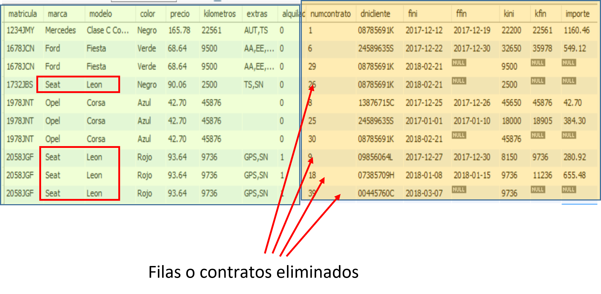
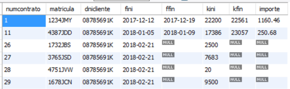

# UNIDAD 5. EDICIÓN DE LOS DATOS

## 1.- ➕ Inserción de filas. Instrucción INSERT

Para insertar filas en una tabla se utiliza la instrucción **INSERT**. Con esta instrucción es posible insertar una o varias filas indicando los valores de las columnas o insertar filas a partir del resultado de una consulta SELECT sobre una o varias tablas.

### 🧩 Formas básicas de INSERT

INSERT ... VALUES
INSERT ... SET

También es posible insertar filas obtenidas de una consulta:

INSERT ... SELECT

### 📌 Sintaxis completa de INSERT ... VALUES

INSERT INTO tabla (col1, col2, ...)
VALUES ({expr1 | DEFAULT}, {expr2 | DEFAULT}, ...),
       ({expr1 | DEFAULT}, {expr2 | DEFAULT}, ...),
       ...
[ ON DUPLICATE KEY UPDATE col_name1 = expr [, col_name2 = expr] ... ]

🔹 Aspectos importantes:
- Entre paréntesis se indican las columnas a las que se asignan valores.  
- Tras VALUES se especifican los valores de cada fila.  
- En una sola instrucción INSERT se pueden insertar varias filas.  
- DEFAULT asigna a la columna su valor por defecto, si existe.  
- Las columnas no indicadas reciben su valor por defecto o NULL (si lo permiten).  
- Si una columna no admite nulos y no tiene valor por defecto, la inserción produce error.  
- La cláusula ON DUPLICATE KEY UPDATE permite actualizar una fila existente cuando se produce un conflicto por clave primaria o única.

#### 📘 Ejemplo 1
Insertar un automóvil Seat León 2.0 TDI, negro, matrícula 4751JVW, con extras GPS y SN, 20 km recorridos y no alquilado. No se indica el precio (se asigna el valor por defecto).

```sql
INSERT INTO automoviles (matricula, marca, modelo, color, kilometros, extras, alquilado) 
VALUES ('4751JVW', 'Seat', 'Leon 2.0 TDI', 'Negro', 20, 'GPS,SN', false);
```
Alternativa sin indicar columnas (hay que respetar el orden de la tabla):

```sql
INSERT INTO automoviles 
VALUES ('4751JVW', 'Seat', 'Leon 2.0 TDI', 'Negro', null, 20, 'GPS,SN', false);
```

#### 📘 Ejemplo 2
Insertar un nuevo contrato iniciado el 19 de febrero de 2018 para el cliente 00371569B con automóvil 5678JRZ y kilómetros iniciales 7659:

```sql
INSERT INTO contratos (matricula, dnicliente, fini, kini) 
VALUES ('5678JRZ', '00371569B', '2018-02-19', 7659);
```

#### 📘 Ejemplo 3
Insertar un nuevo cliente:

```sql
INSERT INTO clientes (nombre, apellidos, localidad, direccion, carnet) 
VALUES ('Javier', 'Quesada Gómez', 'Madrid', 'C/ Marques de Otaiza 3, 4º B', 'B');
```

#### 📘 Ejemplo 4
Insertar un contrato que puede existir ya:

```sql
INSERT INTO contratos (numcontrato, dnicliente, matricula, fini, ffin, kini, kfin)
VALUES (20, '03549358G', '2123JTB', '2018-01-09', '2018-01-21', 34323, 36545);
```

Error: el contrato número 20 ya existe.

Solución usando ON DUPLICATE KEY UPDATE:

```sql
INSERT INTO contratos (numcontrato, dnicliente, matricula, fini, ffin, kini, kfin) 
VALUES (20, '03549358G', '2123JTB', '2018-01-09', '2018-01-21', 34323, 36545) 
ON DUPLICATE KEY UPDATE ffin='2018-01-21', kfin=36545;
```

#### 📘 Ejemplo 5
Insertar un contrato para el cliente 13987654C en la fecha actual:

```sql
INSERT INTO contratos (dnicliente, matricula, fini, kini) 
VALUES ('13987654C', '4387JDD', CURDATE(), 23057);
```

Error: DNI no existe en la tabla clientes → violación de clave ajena (FOREIGN KEY).

#### 📘 Ejemplo 6 — Inserción de múltiples filas

```sql
INSERT INTO clientes (dni, nombre, apellidos, direccion, localidad, fnac, fcarnet, carnet)
VALUES
('96401636R', 'Manuel', 'Gutierrez Motos', 'Calle Barrio Camino', 'Almansa', '1992-02-19', '2010-08-25', 'B'),
('1057451R', 'Pedro', 'Salas Nieto', 'Calle Camarreal', 'Zaragoza', '1970-12-07', '1990-06-13', 'B'),
('66082349R', 'Alba', 'Casaus Rodriguez', 'Bajada de San Juan', 'Móstoles', '1997-02-08', '2015-02-21', 'B');
```

### 🧩 Sintaxis de INSERT ... SET

INSERT INTO tabla
SET col1 = {expr1 | DEFAULT},
    col2 = {expr2 | DEFAULT},
    ...
[ ON DUPLICATE KEY UPDATE col_name1 = expr1, col_name2 = expr2, ... ]

#### 📘 Ejemplo 7

```sql
INSERT INTO automoviles SET 
matricula = '4751JVW', 
marca = 'Seat', 
modelo = 'Leon 2.0 TDI', 
color = 'Negro', 
kilometros = 20, 
extras = 'GPS,SN', 
alquilado = false;
```

### 🔄 INSERT combinado con SELECT

```sql
INSERT INTO tabla (col1, col2, ...)
SELECT ...
[ ON DUPLICATE KEY UPDATE col_name1 = expr1, col_name2 = expr2, ... ]
```

#### 📘 Ejemplo 8
```sql
INSERT INTO contratos 
SELECT * FROM contratos2;
```

Error: existen contratos con el mismo número.

Solución ajustando el número de contrato:
```sql
INSERT INTO contratos (numcontrato, matricula, dnicliente, fini, ffin, kini, kfin) 
SELECT numcontrato + 24, matricula, dnicliente, fini, ffin, kini, kfin 
FROM contratos2;
```
O de forma dinámica:

```sql
INSERT INTO contratos (numcontrato, matricula, dnicliente, fini, ffin, kini, kfin)
SELECT numcontrato + (SELECT MAX(numcontrato) FROM contratos),
       matricula, dnicliente, fini, ffin, kini, kfin
FROM contratos2;
```

#### 📘 Ejemplo 9

Cliente 08785691K alquila todos los Seat disponibles hoy mismo:

```sql
INSERT INTO contratos (matricula, dnicliente, fini, kini) 
SELECT matricula, '08785691K', CURDATE(), kilometros 
FROM automoviles 
WHERE alquilado = false AND marca = 'seat';
```

#### 📘 Ejemplo 10

Mariano Dorado alquila coches con precio inferior a 70€ disponibles hoy:

```sql
INSERT INTO contratos (matricula, dnicliente, fini, kini) 
SELECT matricula, dni, CURDATE(), kilometros 
FROM automoviles, clientes 
WHERE alquilado = false 
AND precio < 70 
AND nombre = 'mariano' 
AND apellidos = 'dorado';
```
Nota: Producto cartesiano → combina todos los coches con el cliente encontrado.

#### 📘 Ejemplo 11

En LIGATERCERA, insertar todos los enfrentamientos posibles entre equipos:
```sql
INSERT INTO calendario (eqLocal, eqVisitante) 
SELECT a.codeq, b.codeq 
FROM equipos AS a, equipos AS b 
WHERE a.codeq != b.codeq;
```

#### HOJAS DE EJERCICIOS

💻 Hoja de ejercicios 1.


## 2.- 🔄 Actualización de datos. La instrucción UPDATE

La instrucción para realizar modificaciones de los datos es **UPDATE**. La sintaxis de UPDATE es:

UPDATE [IGNORE] tabla | combinación_de_tablas  
SET columna1=expresión1, columna2=expresión2, ..... 
WHERE condición;

- Tras UPDATE, se escribe la tabla en la que se van a actualizar datos o, en su caso, la combinación de tablas afectadas por la operación.  
- Modifica los valores de las columnas indicadas en SET con el resultado de las expresiones. Si se usa WHERE, sólo se modifican las filas que cumplen la condición.  
- Dentro de la sintaxis, incluso se permite usar ORDER BY para establecer el orden en que se van modificando datos de filas.

### Condiciones de la sintaxis y ejecución de UPDATE

1. Detrás de UPDATE se puede especificar:
   - El nombre de una tabla si la modificación sólo afecta a esa tabla y está condicionada al contenido de esa tabla.
   - La combinación de varias tablas cuando la modificación afecta a dos o más tablas relacionadas o bien está condicionada al contenido de varias tablas.

2. Detrás de SET se especifican los valores que se van a asignar a las columnas que se quieren modificar. Estos valores pueden ser:
   - Valores constantes.
   - El resultado de una expresión que utiliza o no los valores almacenados en otras columnas o en la misma columna.
   - El resultado de una función.
   - El resultado de una subconsulta.

3. Si para calcular una expresión, se usa una columna que también se modifica, el valor que se usa es el almacenado antes de hacer la modificación.  
4. Es indiferente el orden en el que se especifiquen las columnas a modificar puesto que las modificaciones se ejecutan calculando primero los nuevos valores que va a haber en una fila y modificando después el contenido de la fila con esos valores.  
5. Las expresiones deben ser calculables a partir de los valores correspondientes a la fila que se esté modificando.  
6. Con la cláusula WHERE se indica la condición que deben cumplir las filas que se van a modificar. Si no se usa WHERE, la modificación afectará a todas las filas de la tabla.  
7. Al modificar el contenido de una columna, esta columna deberá cumplir todas las condiciones de dominio, clave principal, clave ajena e integridad referencial que se tengan que cumplir en función de las restricciones establecidas en las tablas de la base de datos.  
8. Si se modifica una clave principal que tiene relación de integridad referencial con actualización en cascada respecto a una clave ajena en otra tabla, el valor de la clave ajena se modifica con el nuevo valor de la clave principal en todas las filas relacionadas.  
9. La cláusula IGNORE no aborta el proceso de actualización cuando se tratan de actualizar varias filas y algunas no pueden actualizarse por conflictos de clave primaria, clave ajena, errores de conversión de datos, etc. Las que producen errores no se actualizan y sí se actualizan las que no los producen. Si no se usa IGNORE y alguna fila produce error, se rechaza por completo la actualización.

#### 📘 Ejemplo 1
Modificar el contrato número 19 para que contenga fecha final 14 de enero de 2020 y kilómetros finales 48111. Comprueba previamente el contenido del contrato 19.

```sql
UPDATE contratos 
SET ffin='2020-01-14', kfin=48111 
WHERE numcontrato=19;
```
Comprueba el contenido del contrato 19 tras ejecutar UPDATE.  
¡¡¡Hay que tener mucho cuidado al probar o realizar estas instrucciones. Si no hubiéramos escrito la condición WHERE, modificaríamos las fechas y kilómetros de todos los contratos existentes!!!

#### 📘 Ejemplo 2
Modificar la columna alquilado del vehículo 7839JDR para que indique que está disponible.

```sql
UPDATE automoviles 
SET alquilado=false 
WHERE matricula='7839JDR';
```

#### 📘 Ejemplo 3
Modificar la columna alquilado del vehículo 7839JDR para que contenga lo opuesto a lo que contenía.

```sql
UPDATE automoviles 
SET alquilado=NOT alquilado 
WHERE matricula='7839JDR';
```

#### 📘 Ejemplo 4
Modificar la columna precio de todos los automóviles de precio de alquiler superior a 100 euros para que su precio se reduzca en un 30% y en un 25% el de los de alquiler inferior a 100 euros. El precio debe quedar con dos decimales.  

Ojo, dado que hay que reducir precios, es importante reducir primero los de precio inferior. Si no se hace así, puede que reduzcamos el precio dos veces para algún coche.

```sql
UPDATE automoviles 
SET precio=round(precio*0.75,2)  
WHERE precio<100;

UPDATE automoviles 
SET precio=round(precio*0.7,2)  
WHERE precio>=100;
```

Se podría dar una solución con una sola instrucción usando la función IF:
```sql
UPDATE automoviles 
SET precio=if(precio<100,round(precio*0.75,2), round(precio*0.7,2));
```
#### 📘 Ejemplo 5
Modificar la matrícula del automóvil de matrícula 3273JGH para que tenga la matrícula 3233JMG.
```sql
UPDATE automoviles 
SET matricula='3233JMG' 
WHERE matricula='3273JGH';
```
Dado que la columna matricula de la tabla contratos es FOREIGN KEY relacionada con las matrículas de automoviles con restricción de integridad referencial por actualización en cascada, además de haberse modificado la matrícula en automóviles, se habrá modificado en todos los contratos correspondientes a ese automóvil.

#### 📘 Ejemplo 6
Modificar las fechas de los contratos para que en todos aquellos que tengan una fecha inicial superior a la fecha actual, se le reste un año.
```sql
UPDATE contratos 
SET fini=subdate(fini,INTERVAL 1 YEAR) 
WHERE fini>curdate();
```
#### 📘 Ejemplo 7
Modificar las fechas de los contratos para que en todos aquellos en los que la fecha final sea inferior a la inicial, se intercambie el valor de esas fechas.
```sql
UPDATE contratos 
SET fini=ffin, ffin=fini 
WHERE fini>ffin;
```
Si al actualizar varias filas, una de ellas da error al actualizar, no se actualiza ninguna. Si no queremos que eso suceda, utilizamos la cláusula IGNORE.
```sql
UPDATE IGNORE contratos 
SET fini=ffin, ffin=fini 
WHERE fini>ffin;
```
Al usar IGNORE, si una de las filas a actualizar da error, no se actualiza, pero el resto de filas que no dan error, sí se actualizan.


## HOJAS DE EJERCICIOS

💻 Hoja de ejercicios 2.

💻 Hoja de ejercicios 3.

## 3.- 🗑️ ELIMINACIÓN DE FILAS. LA INSTRUCCIÓN DELETE

La instrucción para eliminar o borrar filas en tablas es **DELETE**. Con esta instrucción se pueden eliminar **una o varias filas** de una tabla, en función de una condición.

### 🧩 Sintaxis de DELETE

```sql
DELETE [IGNORE] [tabla1, ...]  
FROM {tabla | combinación de tablas}
[WHERE condición] [ORDER BY criterio] [LIMIT num_filas]
```

O bien:

```sql
DELETE [IGNORE] [tabla1, ...]  
USING {tabla | combinación de tablas}
[WHERE condición] [ORDER BY criterio] [LIMIT num_filas]
```

En la instrucción se indica la tabla o las tablas en las que se eliminan filas. Se eliminan las filas resultado de la combinación de tablas indicada tras FROM o USING que cumplan, en su caso, la condición WHERE.

### 📌 Condiciones de la sintaxis y ejecución de DELETE

1. 🧱 Detrás de DELETE se indica la tabla o las tablas en las que se eliminan filas. La combinación de tablas se suele usar cuando la condición WHERE depende del contenido de otra tabla. Lo habitual es eliminar filas de una sola tabla. Es muy poco frecuente eliminar filas de más de una tabla con una sola instrucción DELETE.

2. 🔗 Detrás de FROM o USING se indica la tabla o combinación de tablas (INNER JOIN, LEFT JOIN, producto cartesiano) sobre las que se va a condicionar el borrado. La tabla de la que se eliminan filas debe formar parte obligatoriamente de dicha combinación.

3. 🧾 Si se eliminan filas de una tabla usando solo condiciones de esa misma tabla, no habrá combinación de tablas y la sintaxis será:

```sql
DELETE FROM tabla WHERE ...
```

En este caso, tras DELETE no se escribe el nombre de la tabla. Las filas se eliminan de la tabla indicada tras FROM.

4. ⚠️ Si no se utiliza WHERE, se eliminarán **todas las filas** de la tabla.

5. 🔢 Se puede usar ORDER BY para establecer el orden en el que se eliminan las filas y LIMIT para limitar el número máximo de filas eliminadas.

6. 🔄 Una vez eliminadas las filas, **no se pueden recuperar**, salvo que la eliminación se haya realizado dentro de una **transacción**.

7. 🔐 Si la tabla está relacionada con otras mediante integridad referencial, se aplicarán las reglas definidas:
   - NO ACTION o RESTRICT: no se permite el borrado si existen filas relacionadas.
   - CASCADE: se eliminan también las filas relacionadas en las tablas dependientes.

8. 🧯 La cláusula IGNORE permite que, si alguna fila produce error al eliminarse, no se cancele toda la operación. Se eliminarán las filas posibles y el sistema devolverá avisos warning.


#### 📘 Ejemplo 1 
Eliminar todas las filas de la tabla contratos2.

```sql
DELETE FROM contratos2;
```

#### 📘 Ejemplo 2
Eliminar de la tabla clientes el cliente con DNI 08785691K.

Además del cliente, podrían eliminarse filas en la tabla contratos si existe una relación con borrado en cascada. Si la regla es NO ACTION o RESTRICT, la eliminación no estará permitida.

Comprueba la regla de integridad referencial definida en la FOREIGN KEY entre contratos y clientes.

```sql
DELETE FROM clientes 
WHERE dni = '08785691K';
```


#### 📘 Ejemplo 3
Eliminar todos los contratos realizados hoy.

```sql
DELETE FROM contratos 
WHERE fini = curdate();
```


#### 📘 Ejemplo 4
Eliminar todos los contratos terminados hace más de un año.

```sql
DELETE FROM contratos 
WHERE ffin < date_sub(curdate(), INTERVAL 1 YEAR);
```

#### 📘 Ejemplo 5
Uso de DELETE dentro de una transacción para poder deshacer errores.

1. ▶️ Iniciar una transacción.

```sql
START TRANSACTION;
```

2. 🧹 Eliminar el último contrato registrado.

```sql
DELETE FROM contratos 
ORDER BY numcontrato DESC LIMIT 1;
```

3. ❌ Eliminación accidental de todos los contratos.

```sql
DELETE FROM contratos 
WHERE fini;
```

4. 👀 Comprobamos el contenido de la tabla y detectamos el error.

5. ⏪ Deshacemos todos los cambios realizados durante la transacción.

```sql
ROLLBACK;
```

6. ✅ Si todo hubiese sido correcto, se habría utilizado COMMIT para confirmar los cambios.

#### 📘 Ejemplo 6
Eliminación condicionada mediante combinación de tablas.

Elimina los contratos realizados por el cliente Carlos Javier López Carvajal. La eliminación se realiza en contratos, pero la condición se establece sobre clientes.

```sql
DELETE contratos 
FROM contratos INNER JOIN clientes ON dnicliente = dni 
WHERE nombre = 'carlos javier' 
AND apellidos = 'lopez carvajal';
```

#### 📘 Ejemplo 7
Eliminación de un cliente con contratos asociados sin borrado en cascada.

No es posible eliminar directamente el cliente ni hacerlo en una sola instrucción DELETE sobre varias tablas. Es necesario eliminar primero los contratos y después el cliente.

```sql
DELETE contratos 
FROM contratos INNER JOIN clientes ON dnicliente = dni 
WHERE nombre = 'mariano' 
AND apellidos = 'dorado';

DELETE FROM clientes 
WHERE nombre = 'mariano' 
AND apellidos = 'dorado';
```


## HOJAS DE EJERCICIOS

💻 Hoja de ejercicios 4.

💻 Hoja de ejercicios 5. NO LO HACEMOS

💻 Hoja de ejercicios 6. NO LO HACEMOS

<!-- ## ACTIVIDAD GRUPAL

Esta actividad grupal contará un 10% de la nota de la unidad 5.

💻 Crisis en la empresa. Parte 1.

💻 Crisis en la empresa. Parte 2. -->

## 4.- ✏️ EDICIÓN AVANZADA DE LOS DATOS. INSTRUCCIÓN INSERT

Hasta ahora hemos trabajado con la instrucción **INSERT** usando tres variantes principales:

```sql
INSERT ... VALUES
INSERT ... SET
INSERT ... SELECT
```

🔍 Con las sintaxis `VALUES` y `SET` hemos insertado datos **constantes**, calculados mediante **expresiones** o funciones.  
En este apartado damos un paso más: **insertar datos obtenidos a partir de subconsultas**, todo dentro de **una única instrucción SQL**, que es lo que se exigirá salvo que se indique lo contrario.

---

#### 🧪 Ejemplo 1️⃣ Inserción múltiple usando datos de otra tabla

Queremos insertar **dos nuevos contratos** realizados hoy por el cliente con DNI `11223344M` para los automóviles `5031JHL` y `4738JBJ`.  
Los kilómetros iniciales del contrato deben ser los kilómetros actuales de cada automóvil.

🚫 **Solución no válida** (consultar primero y luego insertar, usando varias instrucciones):

```sql
SELECT kilometros FROM automoviles WHERE matricula='5031JHL';
SELECT kilometros FROM automoviles WHERE matricula='4738JBJ';

INSERT INTO contratos (matricula,dnicliente,fini,kini) 
VALUES ('5031JHL','11223344M',curdate(),24796),
       ('4738JBJ','11223344M',curdate(),8008);
```

✅ **Solución correcta usando INSERT ... SELECT**:

```sql
INSERT INTO contratos (matricula,dnicliente,fini,kini) 
SELECT matricula,'11223344M',curdate(),kilometros
FROM automoviles
WHERE matricula='5031JHL' OR matricula='4738JBJ';
```

✅ **Alternativa usando INSERT ... VALUES con subconsultas**:

```sql
INSERT INTO contratos (matricula,dnicliente,fini,kini) 
VALUES 
('5031JHL','11223344M',curdate(),
 (SELECT kilometros FROM automoviles WHERE matricula='5031JHL')),
('4738JBJ','11223344M',curdate(),
 (SELECT kilometros FROM automoviles WHERE matricula='4738JBJ'));
```

---

#### 🧪 Ejemplo 2️⃣ INSERT con subconsulta para clave ajena

Añadir un contrato realizado hoy por **Sandra Flores Jorje** sobre el automóvil `2058JGF`, usando los kilómetros actuales del vehículo.

```sql
INSERT INTO contratos (matricula,dnicliente,fini,kini) 
VALUES (
'2058JGF',
(SELECT dni FROM clientes WHERE nombre='Sandra' AND apellidos='flores jorje'),
curdate(),
(SELECT kilometros FROM automoviles WHERE matricula='2058JGF')
);
```

---

#### 🧪 Ejemplo 3️⃣ INSERT usando ORDER BY y LIMIT

Añadir un contrato realizado hoy por **Anais Rodriguez** sobre el **automóvil más barato** que **no esté alquilado**.  
Los kilómetros iniciales serán 0.

Consulta previa para localizar el vehículo:

```sql
SELECT matricula 
FROM automoviles 
WHERE alquilado=false 
ORDER BY precio LIMIT 1;
```

Inserción del contrato:

```sql
INSERT INTO contratos (matricula,dnicliente,fini,kini) 
VALUES (
(SELECT matricula FROM automoviles 
 WHERE alquilado=false 
 ORDER BY precio LIMIT 1),
(SELECT dni FROM clientes 
 WHERE nombre='Anais' AND apellidos='Rodriguez'),
curdate(),0
);
```

---

#### 🧪 Ejemplo 4️⃣ INSERT múltiple desde SELECT

Añadir contratos hoy para el cliente `11223344M` sobre los **3 automóviles más baratos** que **no estén alquilados**.

🚫 **Intento incorrecto** (la subconsulta devuelve más de un valor):

```sql
INSERT INTO contratos (matricula,dnicliente,fini,kini) 
VALUES (
(SELECT matricula FROM automoviles 
 WHERE matricula NOT IN (SELECT matricula FROM contratos WHERE ffin IS NULL)
 ORDER BY precio LIMIT 3),
'11223344M',curdate(),0
);
```

❌ Error: la subconsulta devuelve **3 filas** y solo se puede insertar **una por VALUES**.

✅ **Solución correcta usando INSERT ... SELECT**:

```sql
INSERT INTO contratos (matricula,dnicliente,fini,kini) 
SELECT matricula,'11223344M',curdate(),kilometros
FROM automoviles 
WHERE matricula NOT IN (
    SELECT matricula FROM contratos WHERE ffin IS NULL
)
ORDER BY precio LIMIT 3;
```

---

#### 🧪 Ejemplo 5️⃣ INSERT con subconsulta sobre la misma tabla

Añadir un contrato hoy para **Anais Rodriguez** sobre el automóvil más barato **sin contrato activo**.

Consulta previa:

```sql
SELECT matricula 
FROM automoviles 
WHERE matricula NOT IN (
    SELECT matricula FROM contratos WHERE ffin IS NULL
)
ORDER BY precio LIMIT 1;
```

🚫 **Esto produce error**, porque no se puede usar directamente la tabla `contratos` en una subconsulta mientras se insertan datos en ella.

💡 **Solución: renombrar la subconsulta (tabla derivada)**

```sql
INSERT INTO contratos (matricula,dnicliente,fini,kini) 
VALUES (
(SELECT matricula FROM automoviles 
 WHERE matricula NOT IN (
     SELECT a.matricula 
     FROM (SELECT matricula FROM contratos WHERE ffin IS NULL) AS a
 )
 ORDER BY precio LIMIT 1),
(SELECT dni FROM clientes 
 WHERE nombre='Anais' AND apellidos='Rodriguez'),
curdate(),0
);
```

🧠 **Idea clave**: cuando una subconsulta usa la misma tabla sobre la que se inserta, es obligatorio **crear una tabla derivada con alias**.


## HOJAS DE EJERCICIOS

💻 Hoja de ejercicios 7.

## 5.- ACTUALIZACIÓN AVANZADA DE DATOS. INSTRUCCIÓN UPDATE.

Hemos visto que la sintaxis de **UPDATE** es:

```sql
UPDATE [IGNORE] tabla |  combinación_de_tablas  
SET   columna1=expresión, columna2=expresión, ..... 
WHERE condicion;
```

En la instrucción UPDATE podemos usar una combinación de tablas para 

- Indicar las tablas en las que se modifican datos.
- Establecer las condiciones que cumplen las filas en las que se modifican datos.

**Ejemplo 1:** Modificar la columna alquilado  de la tabla automóviles para que todos los automóviles que están actualmente contratados queden marcados como no disponibles y que los que no están contratados figuren como disponibles.

```sql
UPDATE automoviles SET alquilado=false;

UPDATE automoviles INNER JOIN contratos 
ON contratos.matricula=automoviles.matricula  
SET alquilado=true WHERE ffin IS NULL;
```

No es normal, aunque se puede, modificar datos de columnas de dos o más tablas en UPDATE.

**Ejemplo 2:** Modificar la columna alquilado  de la tabla automóviles para que todos los automóviles que están actualmente contratados queden marcados como no disponibles y que la fecha inicial de los contratos actuales de esos automóviles, la fecha de inicio sea un día superior a la que tienen actualmente.

```sql
UPDATE automoviles INNER JOIN contratos 
ON contratos.matricula=automoviles.matricula  
SET alquilado=true,fini=adddate(fini, interval 1 day) 
WHERE ffin IS NULL;
```

**Ejemplo 3:** Suponiendo que añadimos una columna importe a la tabla contratos, establecer el importe de cada contrato finalizado como el precio por los días alquilado.

```sql
ALTER TABLE contratos ADD COLUMN importe decimal(6,2);
```

```sql
UPDATE automoviles INNER JOIN contratos 
ON contratos.matricula=automoviles.matricula  
SET importe=precio*datediff(ffin,fini) 
WHERE ffin IS NOT NULL;
```

Dentro de UPDATE, podemos usar subconsultas, tanto para obtener los valores que se asignan con SET como para establecer las condiciones WHERE.

**Ejemplo 4:** Dentro de UPDATE, podemos usar subconsultas, tanto para obtener los valores que se asignan con SET como para establecer las condiciones WHERE. 

Modificar las fechas de inicio y  de finalización de los contratos realizados por Mariano Dorado para que tengan una fecha un día superior a la que tienen.

```sql
UPDATE contratos  
SET fini=adddate(fini,INTERVAL 1 DAY),ffin=adddate(ffin,INTERVAL 1 DAY)
WHERE dnicliente=
(SELECT dni FROM clientes WHERE nombre='Mariano' AND apellidos='Dorado');
```

Este ejemplo también se podría haber resuelto fácilmente con UPDATE usando un INNER JOIN  entre clientes y contratos.

**Ejemplo 5:** Establecer que el contrato 25 fue realizado por Antonio Diaz Vera.

```sql
UPDATE contratos  
SET dnicliente=
(SELECT dni FROM clientes WHERE nombre='Antonio' AND apellidos='Diaz vera')
WHERE numcontrato=25;
```

**Ejemplo 6:** Establecer que en los kilómetros de los automóviles se carguen los kilómetros finales del último contrato finalizado de cada automóvil.

```sql
UPDATE automoviles SET kilometros=
(SELECT max(kfin) FROM contratos 
WHERE kfin  IS NOT NULL AND contratos.matricula=automoviles.matricula);
```

Como puede verse, en la subconsulta, se compara la matricula de cada contrato con la matricula del automóvil que se está modificando. La ejecución de esta instrucción supone que por cada automóvil, se ejecuta la subconsulta para obtener el máximo valor de kilómetros finales para ese automóvil.

Si un automóvil no tuviera contratos, se cargaría el valor NULL en kilómetros, lo cual no sería muy adecuado. 

**Ejemplo 7:** Para que no ocurra lo anterior, modifica los kilómetros sólo de automóviles con contratos finalizados para que contengan los kilómetros finales de cada uno de los últimos contratos finalizados.

Una posible solución es:

```sql
UPDATE automoviles SET kilometros=
(SELECT max(kfin) FROM contratos 
WHERE kfin  IS NOT NULL AND contratos.matricula=automoviles.matricula)
WHERE matricula IN 
(SELECT matricula FROM contratos 
WHERE ffin  IS NOT NULL);
```

Otra posible solución, quizás más complicada, es usar una subconsulta dentro de la referencia de tablas renombrada a tabla C.

```sql
UPDATE automoviles INNER JOIN (SELECT matricula,max(kfin) AS m 
                                FROM contratos WHERE ffin IS NOT NULL 
                                GROUP BY matricula) 
AS c ON c.matricula=automoviles.matricula  SET kilometros=m;
```
**Ejemplo 8:** Establecer que el contrato número 26 ha sido realizado por el mismo cliente del contrato número 4.

Si hacemos, como puede suponerse:
```sql
UPDATE contratos  
SET dnicliente= (SELECT dnicliente 
                FROM contratos WHERE numcontrato=4)
WHERE numcontrato=26;
```

Nos da un error en la instrucción, bastante común, debido a que no se puede usar en una subconsulta la misma tabla sobre la que se están modificando datos.

Error Code: 1093. You can't specify target table 'contratos' for update in FROM clause

Para solucionarlo hay que usar un renombrado de subconsulta a tabla:

```sql
UPDATE contratos  
SET dnicliente=
(SELECT a.dnicliente FROM (SELECT * FROM contratos WHERE numcontrato=4) AS a)
WHERE numcontrato=26;
```

**Ejemplo 9:** Suponiendo que en la tabla clientes hay  una columna NUMCONTRATOS  para contener cuantos contratos ha realizado cada cliente, establecer en la columna NUMCONTRATOS el número de contratos realizados por Mariano Dorado.

```sql
UPDATE clientes 
SET numcontratos= (SELECT count(*) FROM contratos WHERE dni=dnicliente)
WHERE nombre='Mariano' AND apellidos='Dorado';
```

En la  instrucción UPDATE establecemos que se modifique sólo el cliente llamado Mariano Dorado. 

Para ese cliente, en la subconsulta se obtiene cuantos contratos ha realizado y se asigna ese valor a numcontratos. 

En la subconsulta se cuentan sólo contratos  en los que dnicliente coincide con el valor de dni (el DNI del cliente que se está modificando, es decir, de Mariano Dorado).

```sql
UPDATE clientes 
SET numcontratos= (SELECT count(*) FROM contratos WHERE dni=dnicliente)
WHERE nombre='Mariano' AND apellidos='Dorado';
```

Dicho de otra forma, cuando tenemos una subconsulta dentro de un update tenemos que tener en cuenta que esa subconsulta se va a volver a evaluar por cada línea de la tabla que estamos modificando.

En este ejemplo, por cada cliente en clientes se evaluará la subconsulta: 

```sql
SELECT count(*) FROM contratos WHERE dni=dnicliente.
```

Por eso no tenemos que poner group by, tenemos que usar un where para filtrar todos los contratos y quedarnos solo los que corresponden al dni del cliente que se esté evaluando en ese momento (cuando se modifica la primera línea el dni de la primera, en la segunda el de la segunda, etc.)

**Ejemplo 10:** Suponiendo que en la tabla clientes hay  una columna NUMCONTRATOS  para contener cuantos contratos ha realizado cada cliente, establecer en la columna NUMCONTRATOS el número de contratos realizados por cada cliente.

```sql
UPDATE clientes 
SET numcontratos= (SELECT count(*) FROM contratos WHERE dni=dnicliente);
```

En la  instrucción UPDATE establecemos que se modifiquen todos, no hay WHERE aplicado. Al ejecutar una UPDATE que afecta a varias filas y que tiene subconsultas asignadas a valores con SET, por cada fila, se realiza la subconsulta correspondiente. Por tanto, en nuestro caso, por cada cliente (por cada dni), se obtienen cuantos contratos tienen un dnicliente igual al dni del cliente que se está modificando.

Así a cada cliente se le asigna el número de contratos obtenidos en la subconsulta (los contratos del cliente). A los que no tienen contratos se les asigna de forma correcta el valor cero.

## HOJAS DE EJERCICIOS

💻 Hoja de ejercicios 8.

💻 Hoja de ejercicios 9.

## 6.- ELIMINACIÓN AVANZADA DE DATOS.

La instrucción DELETE admite en su sintaxis una combinación de tablas para indicar la tabla en la que se eliminan filas y las tablas relacionadas que condicionan las filas que se eliminan. La sintaxis para utilizar una combinación de tablas es:

```sql
DELETE [IGNORE] tabla  FROM combinacion_tablas [WHERE condicion]
```

Donde tabla es la tabla en la que se eliminan las filas.
En la combinación de tablas es obligatorio que esté incluida tabla.

**IMPORTANTE:** Hay que recordar que entre DELETE y FROM no se escribe ninguna tabla cuando se eliminan filas en una tabla sobre la que también se establecen las condiciones de eliminación:

```sql
DELETE [IGNORE] FROM tabla [WHERE condicion]

DELETE contratos 
FROM automoviles INNER JOIN contratos ON contratos.matricula=automoviles.matricula
WHERE marca='seat' AND modelo='leon';
```

Resultado de automoviles INNER JOIN contratos ON contratos.matricula=automoviles.matricula:



**Ejemplo 1:** Eliminar todos los clientes que no hayan realizado contratos.

```sql
DELETE clientes 
FROM clientes LEFT JOIN contratos ON dni=dnicliente 
WHERE numcontrato IS NULL;
```

**Ejemplo 2:** Eliminar los contratos realizados por Mariano Dorado.

```sql
DELETE contratos 
FROM clientes INNER JOIN contratos ON dni=dnicliente 
WHERE nombre='Mariano' AND apellidos='Dorado';
```

En el anterior ejemplo teníamos:

```sql
DELETE contratos 
FROM clientes INNER JOIN contratos ON dni=dnicliente 
WHERE nombre='Mariano' AND apellidos='Dorado';
```

Al ejecutar se borrarán los mismos contratos que los devueltos por la SELECT que obtienen los contratos realizados por Mariano Dorado:

```sql
SELECT contratos.*
FROM clientes INNER JOIN contratos ON dni=dnicliente 
WHERE nombre='Mariano' AND apellidos='Dorado';
```



Dentro de una instrucción DELETE también podemos usar subconsultas:

Dentro de la cláusula WHERE (lo  habitual).
Dentro de la cláusula FROM renombrando la subconsulta a tabla (en casos muy excepcionales que no se puedan resolver de otra forma).

**Ejemplo 3:** Eliminar todos los clientes que no hayan hecho ningún contrato. Realizarlo obteniendo en una subconsulta los DNIs de clientes que han realizado contratos.

```sql
DELETE FROM clientes 
WHERE dni NOT IN 
(SELECT DISTINCT dnicliente FROM contratos);
```

**Ejemplo 4:** Eliminar todos los automóviles para los que no se haya iniciado contratos en los dos últimos meses excepto los que tengan contratos más antiguos no finalizados.

```sql
DELETE FROM automoviles  
WHERE matricula NOT IN 
(SELECT DISTINCT matricula FROM contratos 
WHERE ffin IS NULL OR fini>date_sub(curdate(),INTERVAL 2 MONTH));
```

En la subconsulta sacamos matrículas de los que no han finalizado y también de los realizados en los últimos dos meses.

**Ejemplo 5:** Eliminar de la tabla contratos todos los contratos realizados por Jorge Perez Perez.

```sql
DELETE  FROM contratos 
WHERE dnicliente=
(SELECT dni FROM clientes 
WHERE nombre='Jorge' AND apellidos='Perez Perez');
```

**Ejemplo 6:** Eliminar todos los contratos realizados el mismo día que el día de inicio del último contrato del cliente con dni 03549358G.

```sql
DELETE FROM contratos 
WHERE fini=
(SELECT fini FROM contratos 
WHERE dnicliente= '03549358G' 
ORDER BY numcontrato DESC LIMIT 1);
```

ERROR: No se puede usar en una subconsulta alguna de las tablas que hay dentro de DELETE FROM.

SOLUCIÓN: Subconsulta renombrada a tabla

```sql
DELETE FROM contratos 
WHERE fini=
(SELECT a.fini FROM (SELECT * FROM contratos) AS a
WHERE a.dnicliente= '03549358G' 
ORDER BY a.numcontrato DESC LIMIT 1);
```

**Ejemplo 7:** Eliminar de la tabla contratos todos los contratos realizados en el año anterior al actual y anteriores al primer contrato realizado ese año por la clienta Reyes Sanz Lopez.

```sql
DELETE  FROM contratos 
WHERE year(fini)=year(curdate())-1 
AND fini< (SELECT a.fini FROM 
(SELECT * FROM contratos INNER JOIN clientes ON dnicliente=dni) AS a 
WHERE a.nombre='Reyes' AND a.apellidos='Sanz Lopez' 
ORDER BY numcontrato LIMIT 1);
```

## HOJAS DE EJERCICIOS

💻 Hoja de ejercicios 10 (se puede hacer la versión ligera).

## 7.- TRANSACCIONES

Una transacción es un conjunto de operaciones o instrucciones SQL, generalmente de actualización de datos,  que forman un proceso conjunto. 

El conjunto de instrucciones de una transacción no queda realizado a medias, o se realizan todas las operaciones o no se realiza ninguna de las operaciones de la transacción. 

Durante la ejecución de las instrucciones que forman una transacción, podemos anular todas las instrucciones o confirmarlas.

Por defecto, MySQL se comporta de forma que toda instrucción es una transacción que se confirma automáticamente en el momento de ejecutarla. Por tanto, no se puede anular su ejecución una vez realizada. **SE DICE QUE POR DEFECTO TRABAJA EN ESTADO NO TRANSACCIONAL.**

En MySQL se pueden usar transacciones con tablas InnoDB (las tablas que se crean por defecto). En algunos otros tipos de tablas no se pueden usar como, por ejemplo, en tablas MyISAM.

Las cuatro propiedades de las transacciones (ACID) 

- **Atomicidad:** Significa que es una unidad indivisible. Es la propiedad que asegura que la operación se ha realizado o no, y por lo tanto ante un fallo del sistema no puede quedar a medias. 

- **Consistencia:** Indica que después de ejecutarse una transacción, la BD debe quedar en estado correcto. 

- **Isolation (Aislamiento):** Indica que el comportamiento de una transacción no se ve afectada por el hecho de que otras transacciones sean ejecutadas al mismo tiempo. 

- **Durabilidad:** Cuando se completa una transacción con éxito los cambios se vuelven permanentes. 

**Ejemplo de transacción en base de datos alquileres**

Al finalizar un contrato, se deben realizar varias operaciones de actualización:

- Establecer la fecha final del contrato
- Establecer los kilómetros finales del contrato
- Establecer el importe del contrato 
- Marcar el automóvil como no alquilado o disponibles
- Establecer en kilómetros del automóvil los kilómetros que tenía el automóvil al finalizar el contrato.

Todas las instrucciones que realizan estas operaciones deben quedar realizadas o bien no quedar realizada ninguna. Si se realizan algunas de ellas y otras no, la base de datos quedaría en una estado incongruente.

Por ejemplo, si no se realiza la última operación, ocurrirá que un automóvil tendrá menos kilómetros que los que tiene registrados en su último contrato.

**Ejemplo de transacción en base de datos alquileres**

 Escribir las instrucciones que forman la transacción para hacer todas las operaciones correspondientes a que el contrato número 21 finaliza hoy con 73256 kilómetros del automóvil al finalizar el contrato.

```sql
UPDATE contratos 
SET ffin=curdate(),kfin=73256 
WHERE numcontrato=21;

UPDATE contratos INNER JOIN automoviles 
ON contratos.matricula=automoviles.matricula 
SET importe=precio*datediff(ffin,fini) 
WHERE numcontrato=21;

UPDATE contratos INNER JOIN automoviles 
ON contratos.matricula=automoviles.matricula 
SET alquilado=false,kilometros=73256 
WHERE numcontrato=21;
```

En definitiva, para realizar lo anterior como transacción, ejecutaríamos:

```sql
START TRANSACTION;

UPDATE contratos 
SET ffin=curdate(),kfin=73256 
WHERE numcontrato=21;

UPDATE contratos INNER JOIN automoviles 
ON contratos.matricula=automoviles.matricula 
SET importe=precio*datediff(ffin,fini) 
WHERE numcontrato=21;

UPDATE contratos INNER JOIN automoviles 
ON contratos.matricula=automoviles.matricula 
SET alquilado=false,kilometros=73256 
WHERE numcontrato=21;

/*Y si todo ha ido bien, ejecutaríamos al final la instrucción para que se confirme la transacción:*/

COMMIT;
```

En MySQL podemos usar dos estados de gestión de transacciones.

1.- En su configuración por defecto, tiene establecido el **estado no transaccional**. 

Si ejecutamos una instrucción de actualización de datos, ésta queda realmente realizada, no hay vuelta atrás. Podemos realizar transacciones con varias instrucciones iniciando una transacción con START TRANSACTION.Podemos confirmar todos lo realizado en la transacción con COMMIT o anularlo con ROLLBACK.

2.- El otro es el **estado transaccional**. En este estado:

No hay que indicar que se inicia una transacción. Una transacción comienza cuando otra finaliza. Una transacción finaliza cuando se confirma su realización o cuando se anula su realización.


Cambio de estado de gestión de transacciones. Cada sesión cliente MySQL trabaja en un estado (transaccional o no transaccional).

Puedes cambiar el estado para tu sesión mediante la instrucción **SET AUTOCOMMIT**.

```sql
SET AUTOCOMMIT=0;  /*Establece el estado transaccional*/
SET AUTOCOMMIT=1;  /*Establece el estado NO transaccional*/
```

Por defecto, toda sesión se inicia en estado no transaccional (toda instrucción es una transacción que se autoconfirma al ejecutarla).

También podemos leer el estado de esta variable del sistema con la instrucción:

```sql
SHOW VARIABLES WHERE Variable_name='autocommit';
```

**Ejemplo de ejecución de instrucciones en estado transaccional:**

1. INSTRUCCIÓN 1
2. INSTRUCCIÓN 2
3. INSTRUCCIÓN 3
4. COMMIT;   (quedan hechas realmente las instrucciones 1, 2 y 3)
5. INSTRUCCIÓN 4
6. INSTRUCCIÓN 5   (se ha producido algún problema por ser la instrucción incorrecta, por haber sido rechazada su ejecución, etc. y queremos anular la realizado)
7. ROLLBACK; (se anulan las instrucciones 4 y 5, se vuelve al estado en el que estaba la base de datos en el punto 4)
8. INSTRUCCIÓN 6
9. ALTER TABLE …..;  (produce un COMMIT por lo que queda hecha realmente la instrucción 6
10. INSTRUCCIÓN 7
11. INSTRUCCIÓN 8
12. Terminamos la sesión cliente (No se ha confirmado la transacción y queda anulado lo realizado en las instrucciones 7 y 8).

**Ejemplo de ejecución de instrucciones en estado NO transaccional:**

1. INSTRUCCIÓN 1 (queda realmente hecha la instrucción 1)
2. START TRANSACTION (se inicia una transacción)
3. INSTRUCCIÓN 2
4. INSTRUCCIÓN 3
5. COMMIT;   (quedan hechas realmente las instrucciones 2 y 3)
6. INSTRUCCIÓN 4   (queda realmente hecha la instrucción 4)
7. INSTRUCCIÓN 5   (queda realmente hecha la instrucción 5)
8. START TRANSACTION; (se inicia una transacción)
9. INSTRUCCIÓN 6
10. INSTRUCCIÓN 7 (ha habido algún problema)
11. ROLLBACK;  (quedan anuladas las instrucciones 6 y 7)
12. INSTRUCCIÓN 8   (queda realmente hecha la instrucción 8)

En MySQL InnoDB las instrucciones de gestión de transacciones son:

- START TRANSACTION o BEGIN: marca el inicio de una transacción en estado no transaccional. 
- ROLLBACK: Cierra la transacción en curso. Anula las instrucciones realizadas en ella.
- COMMIT: Confirma el conjunto de operaciones ejecutadas tras el comienzo de la transacción.
- SAVEPOINT etiqueta: Donde se ejecute, marca un punto de retorno o punto para anular instrucciones ejecutadas desde ahí en adelante. En etiqueta podemos poner el nombre que queramos.  Dentro de una transacción podemos establecer varios puntos de retorno.
- ROLLBACK TO SAVEPOINT etiqueta: Hace que se anulen las instrucciones ejecutadas desde el punto donde se ejecutó SAVEPOINT etiqueta.  No confirma las instrucciones ejecutadas desde el comienzo de la transacción hasta el punto SAVEPOINT etiqueta.
- SET AUTOCOMMIT=valor: Permite cambiar el estado transaccional de la sesión

Hay muchas instrucciones que producen un **COMMIT IMPLÍCITO**. Es decir, que tras su ejecución es como si hubieses ejecutado también un commit. Algunas de ellas son:

- Las que definen o modifican los objetos de la base de datos: 
```sql
 ALTER EVENT, ALTER FUNCTION, ALTER PROCEDURE, ALTER SERVER, ALTER TABLE, ALTER VIEW, 
 CREATE DATABASE, CREATE EVENT, CREATE FUNCTION, CREATE INDEX, CREATE PROCEDURE, 
 CREATE ROLE, CREATE SERVER, CREATE SPATIAL REFERENCE SYSTEM, CREATE TABLE, 
 CREATE TRIGGER, CREATE VIEW, DROP DATABASE, DROP EVENT, DROP FUNCTION, 
 DROP INDEX, DROP PROCEDURE, DROP ROLE, DROP SERVER, 
 DROP SPATIAL REFERENCE SYSTEM, DROP TABLE, DROP TRIGGER, DROP VIEW...
 ```
Aquellas que modifican la base de datos mysql: 

```sql
 ALTER USER, CREATE USER, DROP USER, GRANT, RENAME USER, REVOKE, SET PASSWORD...
 ```

## HOJAS DE EJERCICIOS

💻 Hoja de ejercicios 11. 

## 8.- CONCURRENCIA

Cuando se realizan varias transacciones de forma simultánea, pueden darse diversas situaciones en el acceso concurrente a los datos, es decir, cuando se accede a un mismo dato en dos transacciones distintas. Estas situaciones son:

- **Lectura sucia** (Dirty Read). Una transacción lee datos que han sido escritos por otra transacción que aún no se ha confirmado.
- **Lectura no repetible** (Non-repeateable Read). Una transacción vuelve a leer los datos que ha leído anteriormente y descubre que otra transacción confirmada ha modificado o eliminado los datos.
- **Lectura fantasma** (Phantom Read). Una transacción vuelve a ejecutar una consulta que devuelve un conjunto de filas que satisface una condición de búsqueda y descubre que otra transacción confirmada ha insertado filas adicionales que satisfacen la condición.

Para una mejor gestión de estas situaciones debemos indicar el nivel de aislamiento que deseamos. De las cuatro propiedades de ACID de un SGBD, la **propiedad de aislamiento** es la más laxa. Un nivel de aislamiento bajo aumenta la capacidad de muchos usuarios para acceder a los mismos datos al mismo tiempo, pero también aumenta el número de efectos de concurrencia (como lecturas sucias). Un mayor nivel de aislamiento puede dar como resultado una pérdida de concurrencia y el aumento de las posibilidades de que una transacción bloquee a otra. 

Podemos solicitar al SGBD cuatro niveles de aislamiento. De menor a mayor nivel de aislamiento, tenemos:

- **READ UNCOMMITTED** (Lectura no confirmada). Las sentencias SELECT son efectuadas sin realizar bloqueos, por tanto, todos los cambios hechos por una transacción pueden verlos las otras transacciones. Permite que sucedan las 3 situaciones indicadas previamente: lecturas fantasma, no repetibles y sucias. 
- **READ COMMITTED** (Lectura confirmada). Los datos leídos por una transacción pueden ser modificados por otras transacciones. Se pueden dar lectuas fantasma y lecturas no repetibles.
- **REPEATEABLE READ** (Lectura repetible). Consiste en que ningún registro leído con un SELECT se puede cambiar en otra transacción. Solo pueden darse lecturas fantasma. 
- **SERIALIZABLE**. Las transacciones ocurren de forma totalmente aislada a otras transacciones. Se bloquean las transacciones de tal manera que ocurren unas detrás de otras, sin capacidad de concurrencia. El SGBD las ejecuta concurrentemente si puede asegurar que no hay conflicto con el acceso a los datos.

**Nivel de aislamiento y Lecturas**

| Nivel de aislamiento | Lecturas sucias | Lecturas no repetibles | Lecturas fantasma |
| ----------- | ------------ | ----------- | ------------ |
| READ UNCOMMITTED  | SÍ | SÍ | SÍ | 
| READ COMMITTED | NO | SÍ | SÍ |
| REPEATEABLE READ | NO | NO | SÍ |
| SERIALIZABLE | NO  | NO | NO |


Internamente el SGBD proporciona dicho nivel de aislamiento mediante **bloqueos** en los datos.


## HOJAS DE EJERCICIOS (DE REPASO)

💻 Hoja de ejercicios 12(es la segunda parte de la 10  ligera).

💻 Hoja de ejercicios 13.

