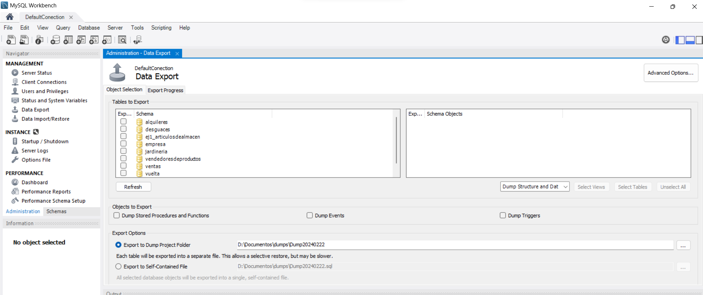
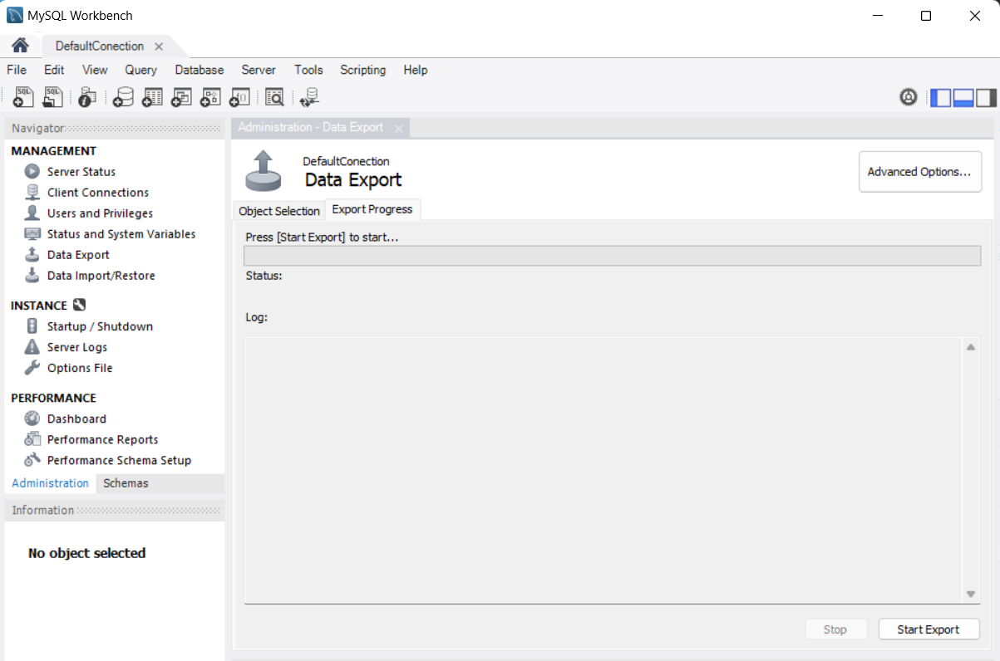

# UNIDAD 7. GESTIÓN DE LA SEGURIDAD DE LOS DATOS
- [UNIDAD 7. GESTIÓN DE LA SEGURIDAD DE LOS DATOS](#unidad-7-gestión-de-la-seguridad-de-los-datos)
  - [🛡️ 1.- SEGURIDAD EN LAS BASES DE DATOS](#️-1--seguridad-en-las-bases-de-datos)
    - [🔐 1.1. Confidencialidad](#-11-confidencialidad)
    - [🧩 1.2. Integridad](#-12-integridad)
    - [🌐 1.3. Disponibilidad](#-13-disponibilidad)
  - [🧰 Medidas para garantizar la seguridad](#-medidas-para-garantizar-la-seguridad)
  - [🔄 2.- RECUPERACIÓN DE DATOS](#-2--recuperación-de-datos)
  - [⚠️ Tipos de fallos](#️-tipos-de-fallos)
    - [💻 Caída del sistema](#-caída-del-sistema)
    - [💽 Fallo de disco](#-fallo-de-disco)
    - [🔥 Problemas físicos o catástrofes](#-problemas-físicos-o-catástrofes)
    - [🦠 Ataques externos y virus](#-ataques-externos-y-virus)
    - [🧱 Errores de diseño](#-errores-de-diseño)
    - [❌ Errores en transacciones](#-errores-en-transacciones)
    - [🚫 Condiciones de excepción](#-condiciones-de-excepción)
    - [🔁 Concurrencia](#-concurrencia)
  - [🔒 Bloqueos](#-bloqueos)
  - [💾 3.- COPIAS DE SEGURIDAD](#-3--copias-de-seguridad)
  - [📦 Tipos de copias de seguridad](#-tipos-de-copias-de-seguridad)
    - [🟢 Completa](#-completa)
    - [🟡 Incremental](#-incremental)
    - [🔵 Diferencial](#-diferencial)
    - [🪞 Espejo](#-espejo)
  - [⏱️ Tipos según ejecución](#️-tipos-según-ejecución)
    - [❄️ En frío](#️-en-frío)
    - [🔥 En caliente](#-en-caliente)
  - [📅 Frecuencia recomendada](#-frecuencia-recomendada)
- [🧰 4.- COPIA DE SEGURIDAD EN MYSQL WORKBENCH](#-4--copia-de-seguridad-en-mysql-workbench)
  - [📤 Exportar base de datos](#-exportar-base-de-datos)
  - [📥 Importar base de datos](#-importar-base-de-datos)
- [📝 HOJAS DE EJERCICIOS](#-hojas-de-ejercicios)
 

## 🛡️ 1.- SEGURIDAD EN LAS BASES DE DATOS

Se entiende por **seguridad de los datos** el conjunto de medidas que se aplican para evitar el acceso indebido, el robo o el tratamiento inadecuado de la información.

La seguridad en bases de datos se basa en tres pilares fundamentales:

### 🔐 1.1. Confidencialidad

Garantiza que la información **no sea difundida sin autorización**.

✔️ Se consigue mediante reglas y permisos que limitan el acceso a los datos.  
✔️ Solo los usuarios autorizados pueden ver determinada información.

### 🧩 1.2. Integridad

Asegura que los datos sean **correctos, coherentes y no se alteren de forma indebida**.

✔️ Solo usuarios autorizados pueden modificar los datos.  
✔️ Se aplican sistemas de autenticación, políticas internas y control de accesos.

### 🌐 1.3. Disponibilidad

Se refiere a que la información esté **accesible cuando se necesite**.

✔️ La base de datos debe funcionar de forma continua y fiable.  
✔️ Se deben evitar interrupciones del servicio.

## 🧰 Medidas para garantizar la seguridad

- 🕶️ Enmascarar datos sensibles (mostrar solo lo necesario)  
- ⚙️ Limitar servicios y funcionalidades al mínimo imprescindible  
- 🔄 Mantener actualizados los SGBD  
- 📊 Utilizar herramientas de análisis y monitorización  
- 💾 Realizar copias de seguridad periódicas  

## 🔄 2.- RECUPERACIÓN DE DATOS

Se entiende por **fallo en el SGBD** cualquier caída del sistema provocada por errores de hardware o software que afectan a las transacciones.

Un SGBD eficiente debe ser capaz de **recuperarse automáticamente tras un fallo**.

## ⚠️ Tipos de fallos

### 💻 Caída del sistema
Fallo de software, hardware o red durante una transacción.

### 💽 Fallo de disco
Pérdida de datos por errores en lectura o escritura del disco.

### 🔥 Problemas físicos o catástrofes
- Apagones ⚡  
- Incendios 🔥  
- Robos o sabotajes 🚨  

### 🦠 Ataques externos y virus
Entrada de malware que afecta al sistema.

✔️ Se recomienda antivirus actualizado.

### 🧱 Errores de diseño
Un mal diseño puede provocar fallos en las transacciones.

### ❌ Errores en transacciones
Fallos como desbordamientos o errores de ejecución.

### 🚫 Condiciones de excepción
Situaciones imprevistas que obligan a cancelar la transacción.

### 🔁 Concurrencia
Acceso simultáneo de varios usuarios a los mismos datos.

✔️ Se gestionan mediante bloqueos.

## 🔒 Bloqueos
- Evitan conflictos entre transacciones  
- Protegen recursos compartidos  
- Garantizan consistencia  

## 💾 3.- COPIAS DE SEGURIDAD

Una **copia de seguridad** es la duplicación de datos para poder recuperarlos en caso de fallo.

## 📦 Tipos de copias de seguridad

### 🟢 Completa
- Copia todos los datos  
- ✔️ Restauración rápida  
- ❌ Lenta y ocupa más espacio  

### 🟡 Incremental
- Copia cambios desde la última copia  
- ✔️ Muy rápida  
- ❌ Restauración más compleja  

### 🔵 Diferencial
- Copia cambios desde la última copia completa  
- ✔️ Buen equilibrio  
- ✔️ Restauración más sencilla que incremental  

### 🪞 Espejo
- Copia en tiempo real  
- ✔️ Muy actualizada  
- ⚠️ Elimina también los cambios eliminados en origen  

## ⏱️ Tipos según ejecución

### ❄️ En frío
- La base de datos se detiene  
- ✔️ Más seguro  
- ❌ Sin acceso de usuarios  

### 🔥 En caliente
- La base de datos sigue activa  
- ✔️ Sin interrupción de servicio  
- ❌ Más complejo  

## 📅 Frecuencia recomendada

- 🗓️ Completa: semanal o diaria  
- 🔁 Incrementales/diferenciales: diarias  

# 🧰 4.- COPIA DE SEGURIDAD EN MYSQL WORKBENCH

En **MySQL Workbench** las copias de seguridad se realizan exportando bases de datos.

## 📤 Exportar base de datos

Opciones disponibles:
- 📁 Seleccionar bases de datos  
- 📄 Exportar estructura y/o datos  
- 💾 Guardar en fichero o carpeta  
- 🏷️ Elegir nombre y ubicación  

## 📥 Importar base de datos

El proceso inverso permite restaurar la información.

# 📝 HOJAS DE EJERCICIOS

💻 Hoja de ejercicios 1  

💻 Hoja de ejercicios 2

